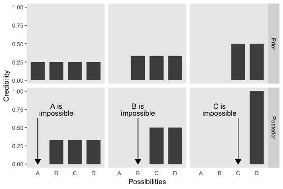
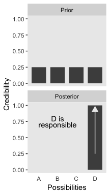
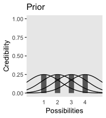
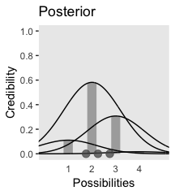
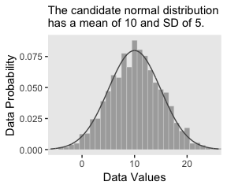
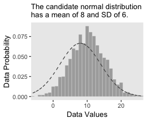
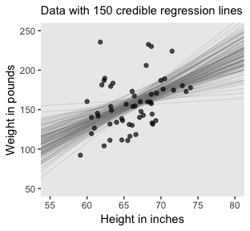
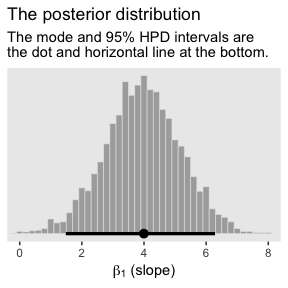
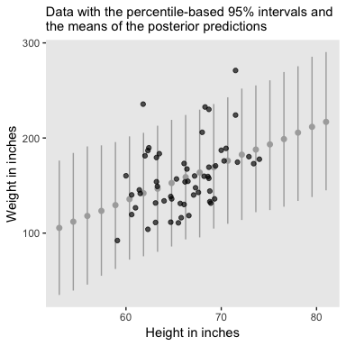
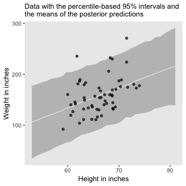

Chapter 02. Introduction: Credibility, Models, and Parameters
================
A Solomon Kurz
2018-08-12

(PART) THE BASICS: MODELS, PROBABILITY, BAYES’ RULE, AND R
==========================================================

In this part of the project, we mainly reproduce figures, but start fitting models more regularly in the latter chapters.

Introduction: Credibility, Models, and Parameters
=================================================

Kruschke opened the chapter with the following:

> The goal of this chapter is to introduce the conceptual framework of Bayesian data analysis. Bayesian data analysis has two foundational ideas. The first idea is that Bayesian inference is reallocation of credibility across possibilities. The second foundational idea is that the possibilities, over which we allocate credibility, are parameter values in meaningful mathematical models.

Bayesian inference is reallocation of credibility across possibilities
----------------------------------------------------------------------

The first step toward making Figure 2.1 is putting together a data object. And to help with that, we'll open up the tidyverse.

``` r
library(tidyverse)

d <-
  tibble(
  iteration = rep(1:3, each = 2*4),
  stage = rep(rep(c("Prior", "Posterior"), each = 4), 
              times = 3),
  Possibilities = rep(LETTERS[1:4], times = 6),
  Credibility = c(rep(.25, times = 4),
                  c(0, rep(1/3, times = 3)),
                  c(0, rep(1/3, times = 3)),
                  rep(c(0, .5), each = 2),
                  rep(c(0, .5), each = 2),
                  c(rep(0, times = 3)), 1)
  ) %>%
  # This last line will help order the facet levels, below
  mutate(stage = factor(stage, levels = c("Prior", "Posterior")))
```

We can take a look at the top few rows of the data with `head()`.

``` r
head(d)
```

    ## # A tibble: 6 x 4
    ##   iteration stage     Possibilities Credibility
    ##       <int> <fct>     <chr>               <dbl>
    ## 1         1 Prior     A                   0.25 
    ## 2         1 Prior     B                   0.25 
    ## 3         1 Prior     C                   0.25 
    ## 4         1 Prior     D                   0.25 
    ## 5         1 Posterior A                   0    
    ## 6         1 Posterior B                   0.333

The code for Figure 2.1 is formidable. However, the bulk (i.e., the two `geom_text()` blocks and the subsequent `geom_line()` block) are just for the annotation in the lower three panels.

``` r
d %>%
  ggplot(aes(x = Possibilities, 
             ymin = 0, ymax = Credibility)) +
  geom_linerange(size = 10, color = "grey30") +
  geom_text(data = tibble(
    Possibilities = "B",
    Credibility = .8,
    label = c("A is", "B is", "C is"),
    iteration = 1:3,
    stage = factor("Posterior", levels = c("Prior", "Posterior"))
  ), aes(y = Credibility,
         label = label)
  ) +
  geom_text(data = tibble(
    Possibilities = "B",
    Credibility = .7,
    label = "impossible",
    iteration = 1:3,
    stage = factor("Posterior", levels = c("Prior", "Posterior"))
  ), aes(y = Credibility,
         label = label)
  ) +
  geom_line(data = tibble(
    Possibilities = rep(LETTERS[1:3], each = 2),
    Credibility = rep(c(.63, 0), times = 3),
    iteration = rep(1:3, each = 2),
    stage = factor("Posterior", levels = c("Prior", "Posterior"))
    ), aes(y = Credibility),
    arrow = arrow(length = unit(0.30,"cm"), 
                  ends = "last", type = "closed")) +
  ylab("Credibility") +
  facet_grid(stage ~ iteration) +
  theme(panel.grid = element_blank(),
        strip.text.x = element_blank(),
        axis.ticks.x = element_blank())
```



Same deal for Figure 2.2.

``` r
tibble(
  stage = rep(c("Prior", "Posterior"), each = 4),
  Possibilities = rep(LETTERS[1:4], times = 2),
  Credibility = c(rep(.25, times = 4),
                  c(rep(0, times = 3)), 1)
  ) %>%
  
  mutate(stage = factor(stage, levels = c("Prior", "Posterior"))) %>%
  
  ggplot(aes(x = Possibilities, 
             ymin = 0, ymax = Credibility)) +
  geom_linerange(size = 10, color = "grey30") +
  geom_text(data = tibble(
    Possibilities = "B",
    Credibility = .8,
    label = "D is",
    stage = factor("Posterior", levels = c("Prior", "Posterior"))
  ), aes(y = Credibility,
         label = label)
  ) +
  geom_text(data = tibble(
    Possibilities = "B",
    Credibility = .7,
    label = "responsible",
    stage = factor("Posterior", levels = c("Prior", "Posterior"))
  ), aes(y = Credibility,
         label = label)
  ) +
  geom_line(data = tibble(
    Possibilities = LETTERS[c(4, 4)],
    Credibility = c(.25, .98),
    stage = factor("Posterior", levels = c("Prior", "Posterior"))
    ), aes(y = Credibility),
    arrow = arrow(length = unit(0.30,"cm"), 
                  ends = "last", type = "closed"),
    color = "grey92") +
  ylab("Credibility") +
  facet_wrap(~stage, ncol = 1) +
  theme(panel.grid = element_blank(),
        axis.ticks.x = element_blank())
```



### Data are noisy and inferences are probabilistic.

It's easier to break Figure 2.3 up into the top and bottom portions. Here's the top.

``` r
d <-
  tibble(x = seq(from = -2, to = 6, by = .01))

mu_1 <- 1
mu_2 <- 2
mu_3 <- 3
mu_4 <- 4

ggplot(data = d, aes(x = x)) +
  # Note the use of mu_i in the data and aes() statements
  geom_ribbon(data = d %>% filter(x > mu_1 - .2 & x < mu_1 + .2),
              aes(ymin = 0, ymax = dnorm(x, mean = mu_1, sd = 1.2)*.75),
              fill = "grey40") +
  geom_ribbon(data = d %>% filter(x > mu_2 - .2 & x < mu_2 + .2),
              aes(ymin = 0, ymax = dnorm(x, mean = mu_2, sd = 1.2)*.75),
              fill = "grey40") +
  geom_ribbon(data = d %>% filter(x > mu_3 - .2 & x < mu_3 + .2),
              aes(ymin = 0, ymax = dnorm(x, mean = mu_3, sd = 1.2)*.75),
              fill = "grey40") +
  geom_ribbon(data = d %>% filter(x > mu_4 - .2 & x < mu_4 + .2),
              aes(ymin = 0, ymax = dnorm(x, mean = mu_4, sd = 1.2)*.75),
              fill = "grey40") +
  geom_line(aes(y = dnorm(x, mean = mu_1, sd = 1.2)*.75)) +  # Note the use of mu_i in the dnorm() statements
  geom_line(aes(y = dnorm(x, mean = mu_2, sd = 1.2)*.75)) +
  geom_line(aes(y = dnorm(x, mean = mu_3, sd = 1.2)*.75)) +
  geom_line(aes(y = dnorm(x, mean = mu_4, sd = 1.2)*.75)) +
  scale_x_continuous(breaks = 1:4) +
  coord_cartesian(xlim = 0:5,
                  ylim = 0:1) +
  labs(title = "Prior",
       x = "Possibilities", 
       y = "Credibility") +
  theme(panel.grid = element_blank(),
        axis.ticks.x = element_blank())
```



Now we're ready for the bottom.

``` r
ggplot(data = d, aes(x = x)) +
  # Note the use of mu_i in the data and aes() statements
  geom_ribbon(data = d %>% filter(x > mu_1 - .2 & x < mu_1 + .2),
              aes(ymin = 0, ymax = dnorm(x, mean = mu_1, sd = 1.2)*1/3),
              fill = "grey67") +
  geom_ribbon(data = d %>% filter(x > mu_2 - .2 & x < mu_2 + .2),
              aes(ymin = 0, ymax = dnorm(x, mean = mu_2, sd = 1.2)*1.75),
              fill = "grey67") +
  geom_ribbon(data = d %>% filter(x > mu_3 - .2 & x < mu_3 + .2),
              aes(ymin = 0, ymax = dnorm(x, mean = mu_3, sd = 1.2)*.925),
              fill = "grey67") +
  geom_ribbon(data = d %>% filter(x > mu_4 - .2 & x < mu_4 + .2),
              aes(ymin = 0, ymax = dnorm(x, mean = mu_4, sd = 1.2)*.05),
              fill = "grey67") +
  geom_line(aes(y = dnorm(x, mean = mu_1, sd = 1.2)*1/3)) +  # Note the use of mu_i in the dnorm() statements
  geom_line(aes(y = dnorm(x, mean = mu_2, sd = 1.2)*1.75)) +
  geom_line(aes(y = dnorm(x, mean = mu_3, sd = 1.2)*.925)) +
  geom_line(aes(y = dnorm(x, mean = mu_4, sd = 1.2)*.05)) +
  geom_point(data = tibble(x = c(1.75, 2.25, 2.75), y = 0),
             aes(x = x, y = y),
             size = 3, color = "grey33", alpha = 3/4) +
  scale_x_continuous(breaks = 1:4) +
  scale_y_continuous(breaks = seq(from = 0, to = 1, by = .2)) +
  coord_cartesian(xlim = 0:5,
                  ylim = 0:1) +
  labs(title = "Posterior",
       x = "Possibilities", 
       y = "Credibility") +
  theme(panel.grid = element_blank(),
        axis.ticks.x = element_blank())
```



Possibilities are parameter values in descriptive models
--------------------------------------------------------

Behold Figure 2.4.a.

``` r
set.seed(2.4)
d <- tibble(x = rnorm(2000, mean = 10, sd = 5))

ggplot(data = d, aes(x = x)) +
  geom_histogram(aes(y = ..density..),
                 binwidth = 1, fill = "grey67", 
                 color = "grey92", size = 1/10) +
  geom_line(data = tibble(x = seq(from = -6, to = 26, by = .01)),
            aes(x = x, y = dnorm(x, mean = 10, sd = 5)),
            color = "grey33") +
  coord_cartesian(xlim = -5:25) +
  labs(subtitle = "The candidate normal distribution\nhas a mean of 10 and SD of 5.",
       x = "Data Values", 
       y = "Data Probability") +
  theme(panel.grid = element_blank())
```



Here's Figure 2.4.b.

``` r
ggplot(data = d, aes(x = x)) +
  geom_histogram(aes(y = ..density..),
                 binwidth = 1, fill = "grey67",
                 color = "grey92", size = 1/8) +
  geom_line(data = tibble(x = seq(from = -6, to = 26, by = .01)),
            aes(x = x, y = dnorm(x, mean = 8, sd = 6)),
            color = "grey33", linetype = 2) +
  coord_cartesian(xlim = -5:25) +
  labs(subtitle = "The candidate normal distribution\nhas a mean of 8 and SD of 6.",
       x = "Data Values", 
       y = "Data Probability") +
  theme(panel.grid = element_blank())
```



The steps of Bayesian data analysis
-----------------------------------

In order to recreate Figure 2.5, we need to generate the data and fit the model. In his "HtWtDataDenerator" R script, Kruschke provided the code for a function that will generate height/weight data of the kind in his text. Here is the code:

``` r
HtWtDataGenerator <- function(nSubj, rndsd = NULL, maleProb = 0.50) {
  # Random height, weight generator for males and females. Uses parameters from
  # Brainard, J. & Burmaster, D. E. (1992). Bivariate distributions for height and
  # weight of men and women in the United States. Risk Analysis, 12(2), 267-275.
  # Kruschke, J. K. (2011). Doing Bayesian data analysis:
  # A Tutorial with R and BUGS. Academic Press / Elsevier.
  # Kruschke, J. K. (2014). Doing Bayesian data analysis, 2nd Edition:
  # A Tutorial with R, JAGS and Stan. Academic Press / Elsevier.
  
  require(MASS)
  
  # Specify parameters of multivariate normal (MVN) distributions.
  # Men:
  HtMmu   <- 69.18
  HtMsd   <- 2.87
  lnWtMmu <- 5.14
  lnWtMsd <- 0.17
  Mrho    <- 0.42
  Mmean   <- c(HtMmu, lnWtMmu)
  Msigma  <- matrix(c(HtMsd^2, Mrho * HtMsd * lnWtMsd,
                      Mrho * HtMsd * lnWtMsd, lnWtMsd^2), nrow = 2)
  # Women cluster 1:
  HtFmu1   <- 63.11
  HtFsd1   <- 2.76
  lnWtFmu1 <- 5.06
  lnWtFsd1 <- 0.24
  Frho1    <- 0.41
  prop1    <- 0.46
  Fmean1   <- c(HtFmu1, lnWtFmu1)
  Fsigma1  <- matrix(c(HtFsd1^2, Frho1 * HtFsd1 * lnWtFsd1,
                       Frho1 * HtFsd1 * lnWtFsd1, lnWtFsd1^2), nrow = 2)
  # Women cluster 2:
  HtFmu2   <- 64.36
  HtFsd2   <- 2.49
  lnWtFmu2 <- 4.86
  lnWtFsd2 <- 0.14
  Frho2    <- 0.44
  prop2    <- 1 - prop1
  Fmean2   <- c(HtFmu2, lnWtFmu2)
  Fsigma2  <- matrix(c(HtFsd2^2, Frho2 * HtFsd2 * lnWtFsd2,
                       Frho2 * HtFsd2 * lnWtFsd2, lnWtFsd2^2), nrow = 2)
  
  # Randomly generate data values from those MVN distributions.
  if (!is.null(rndsd)) {set.seed(rndsd)}
  datamatrix <- matrix(0, nrow = nSubj, ncol = 3)
  colnames(datamatrix) <- c("male", "height", "weight")
  maleval <- 1; femaleval <- 0 # arbitrary coding values
  for (i in 1:nSubj)  {
    # Flip coin to decide sex
    sex <- sample(c(maleval, femaleval), size = 1, replace = TRUE,
                  prob = c(maleProb, 1 - maleProb))
    if (sex == maleval) {datum = mvrnorm(n = 1, mu = Mmean, Sigma = Msigma)}
    if (sex == femaleval) {
      Fclust = sample(c(1, 2), size = 1, replace = TRUE, prob = c(prop1, prop2))
      if (Fclust == 1) {datum = mvrnorm(n = 1, mu = Fmean1, Sigma = Fsigma1)}
      if (Fclust == 2) {datum = mvrnorm(n = 1, mu = Fmean2, Sigma = Fsigma2)}
    }
    datamatrix[i, ] = c(sex, round(c(datum[1], exp(datum[2])), 1))
  }
  
  return(datamatrix)
} # end function
```

Now we have the `HtWtDataGenerator()` function, all we need to do is determine how many values are generated and how probable we want the values to be based on those from men. These are controlled by the `nSubj` and `maleProb` parameters.

``` r
set.seed(57) # This makes the data generation reproducible

d_57 <-
  HtWtDataGenerator(nSubj = 57, maleProb = .5) %>%
  as_tibble()

d_57 %>%
  head()
```

    ## # A tibble: 6 x 3
    ##    male height weight
    ##   <dbl>  <dbl>  <dbl>
    ## 1     0   68.8   133.
    ## 2     1   70     187.
    ## 3     0   63.2   154 
    ## 4     0   61.4   145.
    ## 5     0   66.1   130.
    ## 6     1   71.5   271

We're about ready for the model. We fit it with HMC via the [brms package](https://cran.r-project.org/web/packages/brms/index.html).

``` r
library(brms)
```

The traditional use of [diffuse and noninformative priors is discouraged with HMC, as is the uniform distribution for sigma](https://github.com/stan-dev/stan/wiki/Prior-Choice-Recommendations). Instead, we'll use weakly-regularizing priors for the intercept an slope and a half Cauchy with a fairly large scale parameter for *σ*.

``` r
fit1 <- 
  brm(data = d_57, family = gaussian,
      weight ~ 1 + height,
      prior = c(set_prior("normal(0, 100)", class = "Intercept"),
                set_prior("normal(0, 100)", class = "b"),
                set_prior("cauchy(0, 10)", class = "sigma")),
      chains = 4, iter = 2000, warmup = 1000, cores = 4)
```

If you wanted a quick model summary, you could code `print(fit1)`. We'll walk through that and other diagnostics in greater detail starting in Chapter 8. But for now, here's Figure 2.5.a.

``` r
post <- posterior_samples(fit1)

n_lines <- 150

ggplot(data =  d_57, 
       aes(x = height, y = weight)) +
  geom_abline(intercept = post[1:n_lines, 1], 
              slope = post[1:n_lines, 2],
              color = "grey50", size = 1/4, alpha = .3) +
  geom_point(alpha = 2/3) +
  coord_cartesian(xlim = 55:80,
                  ylim = 50:250) +
  # the eval(substitute(paste())) trick came from: https://www.r-bloggers.com/value-of-an-r-object-in-an-expression/
  labs(subtitle = eval(substitute(paste("Data with", 
                                        n_lines, 
                                        "credible regression lines"))),
       x = "Height in inches",
       y = "Weight in pounds") +
  theme(panel.grid = element_blank())
```



For Figure 2.5.b., we'll use the handy `stat_pointintervalh()` function from the [tidybayes package](https://github.com/mjskay/tidybayes) to mark off the mode and 95% HDIs.

``` r
library(tidybayes)

ggplot(data =  post, aes(x = b_height)) +
  geom_histogram(color = "grey92", fill = "grey67",
                 binwidth = .2, size = .2) +
  stat_pointintervalh(aes(y = 0), 
                      point_interval = mode_hdi, .width = .95) +
  scale_y_continuous(NULL, breaks = NULL) +
  coord_cartesian(xlim = 0:8) +
  labs(title = "The posterior distribution",
       subtitle = "The mode and 95% HPD intervals are\nthe dot and horizontal line at the bottom.",
       x = expression(paste(beta[1], " (slope)"))) +
  theme(panel.grid = element_blank())
```



Here's Figure 2.6. We'll go over the `predict()` function later.

``` r
nd <- tibble(height = seq(from = 53, to = 81, length.out = 20))

pred_fit1 <- 
  predict(fit1, newdata = nd) %>%
  as_tibble() %>%
  bind_cols(nd)

ggplot(data =  pred_fit1, 
       aes(x = height)) +
  geom_pointrange(aes(y = Estimate, 
                      ymin = Q2.5, 
                      ymax = Q97.5),
                  color = "grey67",
                  shape = 20) +
  geom_point(data =  d_57, 
             aes(x = height, y = weight),
             alpha = 2/3) +
  labs(subtitle = "Data with the percentile-based 95% intervals and\nthe means of the posterior predictions",
       x = "Height in inches",
       y = "Weight in inches") +
  theme(panel.grid = element_blank())
```



The posterior predictions might be easier to depict with a ribbon and line, instead.

``` r
nd <- tibble(height = seq(from = 53, to = 81, length.out = 30))

pred_fit1 <- 
  predict(fit1, newdata = nd) %>%
  as_tibble() %>%
  bind_cols(nd)

ggplot(data = pred_fit1, 
       aes(x = height)) +
  geom_ribbon(aes(ymin = Q2.5, 
                  ymax = Q97.5),
                  fill = "grey75") +
  geom_line(aes(y = Estimate),
            color = "grey92") +
  geom_point(data =  d_57, aes(x = height, y = weight),
             alpha = 2/3) +
  labs(subtitle = "Data with the percentile-based 95% intervals and\nthe means of the posterior predictions",
       x = "Height in inches",
       y = "Weight in inches") +
  theme(panel.grid = element_blank())
```



Reference
---------

Kruschke, J. K. (2015). *Doing Bayesian data analysis, Second Edition: A tutorial with R, JAGS, and Stan.* Burlington, MA: Academic Press/Elsevier.

Session info
------------

``` r
sessionInfo()
```

    ## R version 3.5.1 (2018-07-02)
    ## Platform: x86_64-apple-darwin15.6.0 (64-bit)
    ## Running under: macOS High Sierra 10.13.4
    ## 
    ## Matrix products: default
    ## BLAS: /Library/Frameworks/R.framework/Versions/3.5/Resources/lib/libRblas.0.dylib
    ## LAPACK: /Library/Frameworks/R.framework/Versions/3.5/Resources/lib/libRlapack.dylib
    ## 
    ## locale:
    ## [1] en_US.UTF-8/en_US.UTF-8/en_US.UTF-8/C/en_US.UTF-8/en_US.UTF-8
    ## 
    ## attached base packages:
    ## [1] stats     graphics  grDevices utils     datasets  methods   base     
    ## 
    ## other attached packages:
    ##  [1] tidybayes_1.0.1 brms_2.4.0      Rcpp_0.12.18    MASS_7.3-50    
    ##  [5] bindrcpp_0.2.2  forcats_0.3.0   stringr_1.3.1   dplyr_0.7.6    
    ##  [9] purrr_0.2.5     readr_1.1.1     tidyr_0.8.1     tibble_1.4.2   
    ## [13] ggplot2_3.0.0   tidyverse_1.2.1
    ## 
    ## loaded via a namespace (and not attached):
    ##  [1] nlme_3.1-137              matrixStats_0.54.0       
    ##  [3] xts_0.10-2                lubridate_1.7.4          
    ##  [5] threejs_0.3.1             httr_1.3.1               
    ##  [7] LaplacesDemon_16.1.1      rprojroot_1.3-2          
    ##  [9] rstan_2.17.3              tools_3.5.1              
    ## [11] backports_1.1.2           utf8_1.1.4               
    ## [13] R6_2.2.2                  DT_0.4                   
    ## [15] lazyeval_0.2.1            colorspace_1.3-2         
    ## [17] withr_2.1.2               tidyselect_0.2.4         
    ## [19] gridExtra_2.3             mnormt_1.5-5             
    ## [21] Brobdingnag_1.2-5         compiler_3.5.1           
    ## [23] cli_1.0.0                 rvest_0.3.2              
    ## [25] HDInterval_0.2.0          arrayhelpers_1.0-20160527
    ## [27] shinyjs_1.0               xml2_1.2.0               
    ## [29] labeling_0.3              colourpicker_1.0         
    ## [31] scales_0.5.0              dygraphs_1.1.1.5         
    ## [33] mvtnorm_1.0-8             psych_1.8.4              
    ## [35] ggridges_0.5.0            digest_0.6.15            
    ## [37] StanHeaders_2.17.2        foreign_0.8-70           
    ## [39] rmarkdown_1.10            base64enc_0.1-3          
    ## [41] pkgconfig_2.0.1           htmltools_0.3.6          
    ## [43] htmlwidgets_1.2           rlang_0.2.1              
    ## [45] readxl_1.1.0              rstudioapi_0.7           
    ## [47] shiny_1.1.0               svUnit_0.7-12            
    ## [49] bindr_0.1.1               zoo_1.8-2                
    ## [51] jsonlite_1.5              crosstalk_1.0.0          
    ## [53] gtools_3.8.1              inline_0.3.15            
    ## [55] magrittr_1.5              loo_2.0.0                
    ## [57] bayesplot_1.6.0           Matrix_1.2-14            
    ## [59] munsell_0.5.0             abind_1.4-5              
    ## [61] stringi_1.2.3             yaml_2.1.19              
    ## [63] ggstance_0.3              plyr_1.8.4               
    ## [65] grid_3.5.1                parallel_3.5.1           
    ## [67] promises_1.0.1            crayon_1.3.4             
    ## [69] miniUI_0.1.1.1            lattice_0.20-35          
    ## [71] haven_1.1.2               hms_0.4.2                
    ## [73] knitr_1.20                pillar_1.2.3             
    ## [75] igraph_1.2.1              markdown_0.8             
    ## [77] shinystan_2.5.0           reshape2_1.4.3           
    ## [79] stats4_3.5.1              rstantools_1.5.0         
    ## [81] glue_1.2.0                evaluate_0.10.1          
    ## [83] modelr_0.1.2              httpuv_1.4.4.2           
    ## [85] cellranger_1.1.0          gtable_0.2.0             
    ## [87] assertthat_0.2.0          mime_0.5                 
    ## [89] xtable_1.8-2              broom_0.4.5              
    ## [91] coda_0.19-1               later_0.7.3              
    ## [93] rsconnect_0.8.8           shinythemes_1.1.1        
    ## [95] bridgesampling_0.4-0
