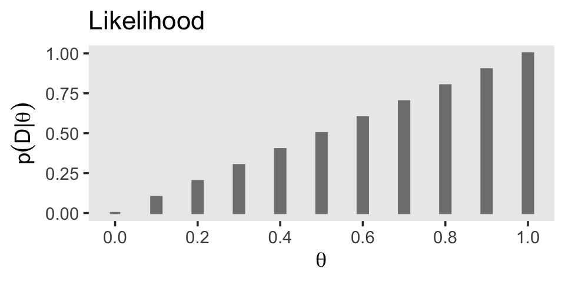
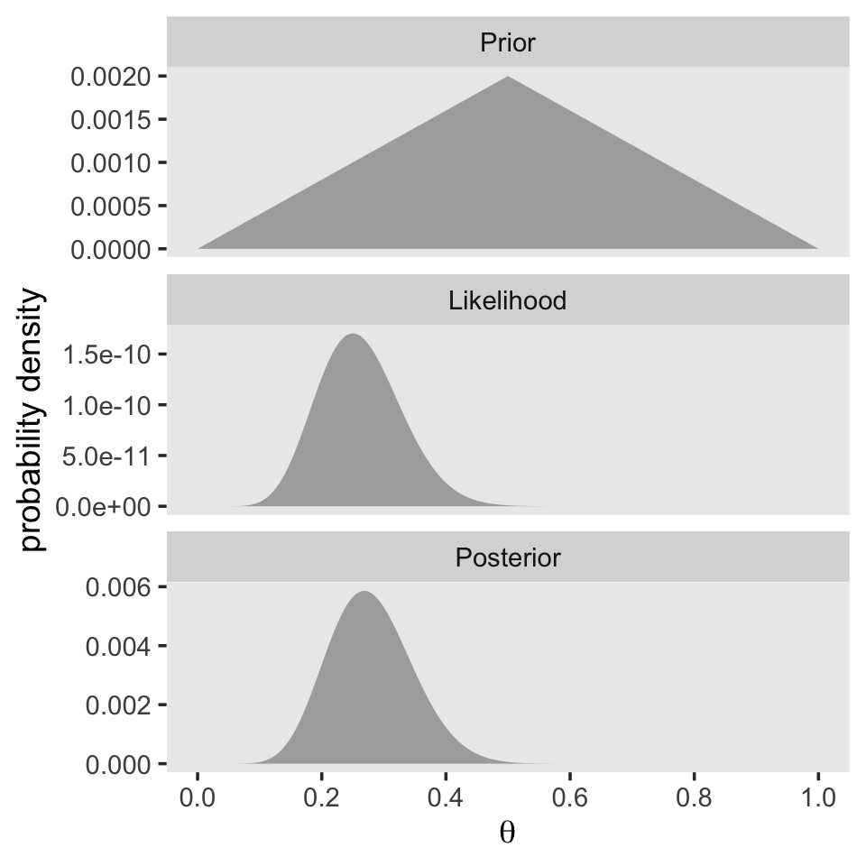
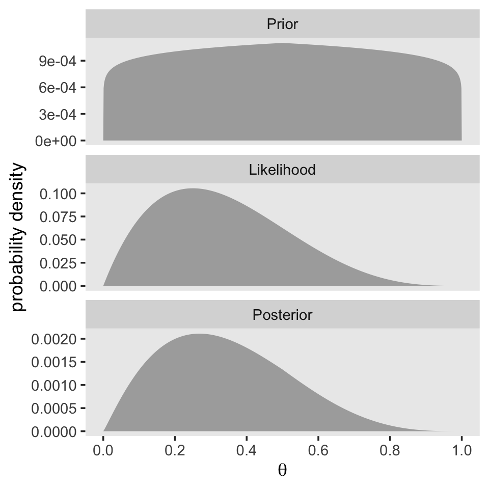

# Bayes' Rule

"Bayes' rule is merely the mathematical relation between the prior allocation of credibility and the posterior reallocation of credibility conditional on data" (pp. 99--100).

## Bayes' rule

> Thomas Bayes (1702-1761) was a mathematician and Presbyterian minister in England. His famous theorem was published posthumously in 1763, thanks to the extensive editorial efforts of his friend, Richard Price ([Bayes & Price, 1763](http://www.stat.ucla.edu/history/essay.pdf)). The simple rule has vast ramifications for statistical inference, and therefore as long as his name is attached to the rule, we'll continue to see his name in textbooks. But Bayes himself probably was not fully aware of these ramifications, and many historians argue that it is Bayes' successor, Pierre-Simon Laplace (1749-1827), whose name should really label this type of analysis, because it was Laplace who independently rediscovered and extensively developed the methods (e.g., [Dale, 1999](https://books.google.com/books/about/A_History_of_Inverse_Probability.html?id=dGweIIXbAgMC); [McGrayne, 2011](https://yalebooks.yale.edu/book/9780300188226/theory-would-not-die)). (p. 100)

I do recommend checking out McGrayne's book It's an easy and entertaining read. For a sneak preview, why not [listen to her](https://www.youtube.com/watch?v=8oD6eBkjF9o) discuss the main themes she covered in her book?

### Derived from definitions of conditional probability.

With equations 5.5 and 5.6, Kruschke gave us Bayes' rule in terms of $c$ and $r$. Equation 5.5 was

$$p(c|r) = \frac{p(r|c)p(c)}{p(r)}.$$

Since $p(r) = \sum_{c^*}p(r|c^*)p(c^*)$, we can re-express that as Equation 5.6:

$$p(c|r) = \frac{p(r|c)p(c)}{\sum_{c^*}p(r|c^*)p(c^*)},$$

where $c^*$ "in the denominator is a variable that takes on all possible values" of $c$ (p. 101).

## Applied to parameters and data

Here we get those equations re-expressed in the terms data analysts tend to think with, parameters (i.e., $\theta$) and data (i.e., $D$).

$$
\begin{align*}
p(\theta|D) & = \frac{p(D|\theta)p(\theta)}{p(D)} \;\; \text{and since} \\
p(D)        & = \sum\limits_{\theta^*}p(D|\theta^*)p(\theta^*) \;\; \text{it's also the case that} \\
p(\theta|D) & = \frac{p(D|\theta)p(\theta)}{\sum\limits_{\theta^*}p(D|\theta^*)p(\theta^*)}.
\end{align*}
$$

As in the previous section where we spoke in terms of $r$ and $c$, our updated $\theta^*$ notation is meant to indicate all possible values of $\theta$. For practice, it's worth repeating how Kruschke broke this down with Equation 5.7, 


$$
\underbrace{p(\theta|D)}_\text{posterior} \; = \; \underbrace{p(D|\theta)}_\text{likelihood} \;\; \underbrace{p(\theta)}_\text{prior} \; / \; \underbrace{p(D)}_\text{evidence}.
$$

> The "prior," $p(\theta)$, is the credibility of the $\theta$ values without the data $D$. The "posterior," $p(\theta|D)$, is the credibility of $\theta$ values with the data $D$ taken into account. The "likelihood," $p(D|\theta)$, is the probability that the data could be generated by the model with parameter value $\theta$. The "evidence" for the model, $p(D)$, is the overall probability of the data according to the model, determined by averaging across all possible parameter values weighted by the strength of belief in those parameter values. (pp. 106--107)

And don't forget, "evidence" is short "marginal likelihood," which is the term we'll use in some of our code, below.

## Complete examples: Estimating bias in a coin

Here's a way to make Figure 5.1.a.


```r
library(tidyverse)

tibble(theta = seq(from   = 0,   to = 1,  by = .1),
       prior = c(seq(from = 0,   to = .2, length.out = 6),
                 seq(from = .16, to = 0,  length.out = 5))) %>%
  
  ggplot(aes(x = theta, y = prior)) +
  geom_col(width = .025, color = "grey50", fill = "grey50") +
  scale_x_continuous(breaks = seq(from = 0, to = 1, by = .2)) +
  labs(title = "Prior",
       x = expression(theta),
       y = expression(paste("p(", theta, ")"))) +
  theme(panel.grid = element_blank())
```

<!-- -->

If you were curious, it is indeed the case that those `prior` values sum to 1.


```r
tibble(prior = c(seq(from = 0,   to = .2, length.out = 6),
                 seq(from = .16, to = 0,  length.out = 5))) %>% 
  summarise(s = sum(prior))
```

```
## # A tibble: 1 x 1
##       s
##   <dbl>
## 1     1
```

If we follow Kruschke's equation 5.10 (i.e., the Bernoulli function) closely, we can express it as a function in **R**.


```r
bernoulli <- function(theta, y){
  return(theta^y * (1 - theta)^(1 - y))
}
```

To get a sense of how it works, consider a single coin flip of heads when heads is considered a successful trial. We'll call the single successful trial `y = 1`. We can use our custom `bernoulli()` function to compute the likelihood of different values of $\theta$. We'll look at 11 candidate $\theta$ values, which we'll call `theta_sequence`. 


```r
theta_sequence <- seq(from = 0, to = 1, by = .1)

bernoulli(theta = theta_sequence, y = 1)
```

```
##  [1] 0.0 0.1 0.2 0.3 0.4 0.5 0.6 0.7 0.8 0.9 1.0
```

Notice how our `theta_sequence` corresponds nicely with the sequence of $\theta$ values on the x-axes of Figure 5.1. We can combine `theta_sequence` and our `bernoulli()` function to make the middle panel of Figure 5.1


```r
tibble(x = theta_sequence) %>%
  mutate(likelihood = bernoulli(theta = theta_sequence, y = 1)) %>% 
  
  ggplot(aes(x = x, y = likelihood)) +
  geom_col(width = .025, color = "grey50", fill = "grey50") +
  scale_x_continuous(breaks = seq(from = 0, to = 1, by = .2)) +
  labs(title = "Likelihood",
       x = expression(theta),
       y = expression(paste("p(D|", theta, ")"))) +
  theme(panel.grid = element_blank())
```

<!-- -->

In order to compute $p(D)$ (i.e., the *evidence* or the *marginal likelihood*), we'll need to multiply our respective prior and likelihood values for each point in our theta sequence and then sum all that up. That sum will be our *marginal likelihood*. With that cleared up, we can make Figure 5.1.c.


```r
tibble(theta = theta_sequence,
       prior = c(seq(from = 0,   to = .2, length.out = 6),
                 seq(from = .16, to = 0,  length.out = 5))) %>%
  mutate(likelihood          = bernoulli(theta = theta_sequence, y = 1)) %>% 
  mutate(marginal_likelihood = sum(prior * likelihood)) %>% 
  mutate(posterior           = (prior * likelihood) / marginal_likelihood) %>%
  
  ggplot(aes(x = theta, y = posterior)) +
  geom_col(width = .025, color = "grey50", fill = "grey50") +
  scale_x_continuous(breaks = seq(from = 0, to = 1, by = .2)) +
  labs(title = "Posterior",
       x = expression(theta),
       y = expression(paste("p(", theta, "|D)"))) +
  theme(panel.grid = element_blank())
```

<!-- -->

### Influence of sample size on the posterior.

In order to follow along with this section, we're going to have to update our Bernoulli likelihood function so it can accommodate more than a single trial. We'll anticipate chapter 6 and call our more general function the `bernoulli_likelihood()`.


```r
bernoulli_likelihood <- function(theta, data) {
  # `theta` = success probability parameter ranging from 0 to 1
  # `data` = the vector of data (i.e., a series of 0s and 1s)
  n   <- length(data)
  return(theta^sum(data) * (1 - theta)^(n - sum(data)))
  }
```

Here's the work required to make our version of the left portion of Figure 5.2.


```r
small_data <- rep(0:1, times = c(3, 1))

tibble(theta =   seq(from = 0,     to = 1, by = .001),
       Prior = c(seq(from = 0,     to = 1, length.out = 501),
                 seq(from = 0.998, to = 0, length.out = 500))) %>% 
  mutate(Prior      = Prior / sum(Prior),
         Likelihood = bernoulli_likelihood(theta = theta,
                                           data  = small_data)) %>% 
  mutate(marginal_likelihood = sum(Prior * Likelihood)) %>% 
  mutate(Posterior           = (Prior * Likelihood) / marginal_likelihood) %>% 
  select(theta, Prior, Likelihood, Posterior) %>% 
  gather(key, value, -theta) %>% 
  mutate(key = factor(key, levels = c("Prior", "Likelihood", "Posterior"))) %>% 

  ggplot(aes(x = theta, ymin = 0, ymax = value)) +
  geom_ribbon(fill = "grey67") +
  scale_x_continuous(breaks = seq(from = 0, to = 1, by = .2)) +
  labs(x = expression(theta),
       y = "probability density") +
  theme(panel.grid = element_blank()) +
  facet_wrap(~key, scales = "free_y", ncol = 1)
```

<!-- -->

We’ll follow the same procedure to make the right portion of Figure 5.2. The only difference is how we switched from `small_data` to `large_data`.


```r
large_data <- rep(0:1, times = c(30, 10))

tibble(theta =   seq(from = 0,     to = 1, by = .001),
       Prior = c(seq(from = 0,     to = 1, length.out = 501),
                 seq(from = 0.998, to = 0, length.out = 500))) %>% 
  mutate(Prior      = Prior / sum(Prior),
         Likelihood = bernoulli_likelihood(theta = theta,
                                           data  = large_data)) %>% 
  mutate(marginal_likelihood = sum(Prior * Likelihood)) %>% 
  mutate(Posterior           = (Prior * Likelihood) / marginal_likelihood) %>% 
  select(theta, Prior, Likelihood, Posterior) %>% 
  gather(key, value, -theta) %>% 
  mutate(key = factor(key, levels = c("Prior", "Likelihood", "Posterior"))) %>% 
  
  ggplot(aes(x = theta, ymin = 0, ymax = value)) +
  geom_ribbon(fill = "grey67") +
  scale_x_continuous(breaks = seq(from = 0, to = 1, by = .2)) +
  labs(x = expression(theta),
       y = "probability density") +
  theme(panel.grid = element_blank()) +
  facet_wrap(~key, scales = "free_y", ncol = 1)
```

<!-- -->

With just an $N = 40$, the likelihood already dominated the posterior. But this is also a function of our fairly gentle prior.

### Influence of prior on the posterior.

It's not immediately obvious how Kruschke made his prior distributions for Figure 5.3. However, hidden away in his `BernGridExample.R` file he indicated that to get the distribution for the left side of Figure 5.3, you simply raise the prior from the left of Figure 5.2 to the 0.1 power.


```r
small_data <- rep(0:1, times = c(3, 1))

tibble(theta =   seq(from = 0,     to = 1, by = .001),
       Prior = c(seq(from = 0,     to = 1, length.out = 501),
                 seq(from = 0.998, to = 0, length.out = 500))) %>% 
  # here's the important line of code
  mutate(Prior = Prior^0.1) %>% 
  mutate(Prior = Prior / sum(Prior),
         Likelihood = bernoulli_likelihood(theta = theta,
                                           data  = small_data)) %>% 
  mutate(marginal_likelihood = sum(Prior * Likelihood)) %>% 
  mutate(Posterior           = (Prior * Likelihood) / marginal_likelihood) %>% 
  select(theta, Prior, Likelihood, Posterior) %>% 
  gather(key, value, -theta) %>% 
  mutate(key = factor(key, levels = c("Prior", "Likelihood", "Posterior"))) %>% 

  ggplot(aes(x = theta, ymin = 0, ymax = value)) +
  geom_ribbon(fill = "grey67") +
  scale_x_continuous(breaks = seq(from = 0, to = 1, by = .2)) +
  labs(x = expression(theta),
       y = "probability density") +
  theme(panel.grid = element_blank()) +
  facet_wrap(~key, scales = "free_y", ncol = 1)
```

<!-- -->

The trick is similar for the right half of Figure 5.3.


```r
large_data <- rep(0:1, times = c(30, 10))

tibble(theta =   seq(from = 0,     to = 1, by = .001),
       Prior = c(seq(from = 0,     to = 1, length.out = 501),
                 seq(from = 0.998, to = 0, length.out = 500))) %>% 
  mutate(Prior      = Prior / sum(Prior),
         Likelihood = bernoulli_likelihood(theta = theta,
                                           data  = large_data)) %>% 
  # here's the important line of code
  mutate(Prior               = Prior^10) %>% 
  mutate(marginal_likelihood = sum(Prior * Likelihood)) %>% 
  mutate(Posterior           = (Prior * Likelihood) / marginal_likelihood) %>% 
  select(theta, Prior, Likelihood, Posterior) %>% 
  gather(key, value, -theta) %>% 
  mutate(key = factor(key, levels = c("Prior", "Likelihood", "Posterior"))) %>% 
  
  ggplot(aes(x = theta, ymin = 0, ymax = value)) +
  geom_ribbon(fill = "grey67") +
  scale_x_continuous(breaks = seq(from = 0, to = 1, by = .2)) +
  labs(x = expression(theta),
       y = "probability density") +
  theme(panel.grid = element_blank()) +
  facet_wrap(~key, scales = "free_y", ncol = 1)
```

<!-- -->

> Bayesian inference is intuitively rational: With a strongly informed prior that uses a lot of previous data to put high credibility over a narrow range of parameter values, it takes a lot of novel contrary data to budge beliefs away from the prior. But with a weakly informed prior that spreads credibility over a wide range of parameter values, it takes relatively little data to shift the peak of the posterior distribution toward the data (although the posterior will be relatively wide and uncertain). (p. 114)

## Why Bayesian inference can be difficult

> Determining the posterior distribution directly from Bayes, rule involves computing the evidence (a.k.a. marginal likelihood) in Equations 5.8 and 5.9. In the usual case of continuous parameters, the integral in Equation 5.9 can be impossible to solve analytically. Historically, the difficulty of the integration was addressed by restricting models to relatively simple likelihood functions with corresponding formulas for prior distributions, called *conjugate* priors, that "played nice" with the likelihood function to produce a tractable integral. (p. 115, *emphasis* in the original)

However, the simple model + conjugate prior approach has its limitations. As we'll see, we often want to fit complex models without shackling ourselves with conjugate priors—which can be quite a pain to work with. Happily, 

> another kind of approximation involves randomly sampling a large number of representative combinations of parameter values from the posterior distribution. In recent decades, many such algorithms have been developed, generally referred to as Markov chain Monte Carlo (MCMC) methods. What makes these methods so useful is that they can generate representative parameter-value combinations from the posterior distribution of complex models *without* computing the integral in Bayes' rule. It is the development of these MCMC methods that has allowed Bayesian statistical methods to gain practical use. (pp. 115--116, *emphasis* in the original)

## Reference {-}

[Kruschke, J. K. (2015). *Doing Bayesian data analysis, Second Edition: A tutorial with R, JAGS, and Stan.* Burlington, MA: Academic Press/Elsevier.](https://sites.google.com/site/doingbayesiandataanalysis/)

## Session info {-}


```r
sessionInfo()
```

```
## R version 3.6.0 (2019-04-26)
## Platform: x86_64-apple-darwin15.6.0 (64-bit)
## Running under: macOS High Sierra 10.13.6
## 
## Matrix products: default
## BLAS:   /Library/Frameworks/R.framework/Versions/3.6/Resources/lib/libRblas.0.dylib
## LAPACK: /Library/Frameworks/R.framework/Versions/3.6/Resources/lib/libRlapack.dylib
## 
## locale:
## [1] en_US.UTF-8/en_US.UTF-8/en_US.UTF-8/C/en_US.UTF-8/en_US.UTF-8
## 
## attached base packages:
## [1] stats     graphics  grDevices utils     datasets  methods   base     
## 
## other attached packages:
## [1] forcats_0.4.0   stringr_1.4.0   dplyr_0.8.3     purrr_0.3.3    
## [5] readr_1.3.1     tidyr_1.0.0     tibble_2.1.3    ggplot2_3.2.1  
## [9] tidyverse_1.2.1
## 
## loaded via a namespace (and not attached):
##  [1] tidyselect_0.2.5 xfun_0.10        haven_2.1.0      lattice_0.20-38 
##  [5] colorspace_1.4-1 vctrs_0.2.0      generics_0.0.2   htmltools_0.4.0 
##  [9] yaml_2.2.0       utf8_1.1.4       rlang_0.4.1      pillar_1.4.2    
## [13] glue_1.3.1.9000  withr_2.1.2      modelr_0.1.4     readxl_1.3.1    
## [17] lifecycle_0.1.0  munsell_0.5.0    gtable_0.3.0     cellranger_1.1.0
## [21] rvest_0.3.4      evaluate_0.14    labeling_0.3     knitr_1.23      
## [25] fansi_0.4.0      broom_0.5.2      Rcpp_1.0.2       scales_1.0.0    
## [29] backports_1.1.5  jsonlite_1.6     hms_0.4.2        digest_0.6.21   
## [33] stringi_1.4.3    grid_3.6.0       cli_1.1.0        tools_3.6.0     
## [37] magrittr_1.5     lazyeval_0.2.2   crayon_1.3.4     pkgconfig_2.0.3 
## [41] zeallot_0.1.0    ellipsis_0.3.0   xml2_1.2.0       lubridate_1.7.4 
## [45] assertthat_0.2.1 rmarkdown_1.13   httr_1.4.0       rstudioapi_0.10 
## [49] R6_2.4.0         nlme_3.1-139     compiler_3.6.0
```


