Chapter 21. Dichotomous Predicted Variable
================
A Solomon Kurz
2019-11-19

# Dichotomous Predicted Variable

> This chapter considers data structures that consist of a dichotomous
> predicted variable. The early chapters of the book were focused on
> this type of data, but now we reframe the analyses in terms of the
> generalized linear model…
> 
> The traditional treatment of these sorts of data structure is called
> “logistic regression.” In Bayesian software it is easy to generalize
> the traditional models so they are robust to outliers, allow different
> variances within levels of a nominal predictor, and have hierarchical
> structure to share information across levels or factors as
> appropriate. (pp. 621–622)

## Multiple metric predictors

“We begin by considering a situation with multiple metric predictors,
because this case makes it easiest to visualize the concepts of logistic
regression” (p. 623).

Figure 21.1 is beyond the scope of our **ggplot2** paradigm. But we will
discuss an alternative in the end of section 21.1.2.

### The model and implementation in ~~JAGS~~ brms.

Our statistical model will follow the form

where

\[\operatorname{logistic} (x) = \frac{1}{(1 + \exp (-x))}.\]

The generic **brms** code for logistic regression using the Bernoulli
likelihood looks like so.

``` r
fit <-
  brm(data = my_data, 
      family = bernoulli,
      y ~ 1 + x1 + x2,
      prior = c(prior(normal(0, 2), class = Intercept),
                prior(normal(0, 2), class = b)))
```

Note that this syntax presumes the predictor variables have already been
standardized.

We’d be remiss not to point out that you can also specify the model
using the binomial distribution. That code would look like this.

``` r
fit <-
  brm(data = my_data, 
      family = binomial,
      y | trials(1) ~ 1 + x1 + x2,
      prior = c(prior(normal(0, 2), class = Intercept),
                prior(normal(0, 2), class = b)))
```

And the results of these two should be the same as long as the dara are
not aggregated. In **brms**, the default link for both `family =
bernoulli` and `family = binomial` models is `logit`, which is exactly
what we want, here. Also, note the additional `| trials(1)` syntax on
the left side of the model formula. You could get away with omitting
this in older versions of **brms**. But newer versions bark at you to
specify how many of trials each row in the data represents. This is
because, as with the baseball data we’ll use later in the chapter, the
binomial distribution includes an \(n\) parameter. When working with
un-aggregated data like what we’re about to do, below, it’s presumed
that \(n = 1\).

### Example: Height, weight, and gender.

Load the height/weight data.

``` r
library(tidyverse)

my_data <- read_csv("/Users/solomon/Dropbox/Recoding Doing Bayesian Data Analysis/data.R/HtWtData110.csv")

glimpse(my_data)
```

    ## Observations: 110
    ## Variables: 3
    ## $ male   <dbl> 0, 0, 0, 0, 1, 1, 1, 0, 1, 0, 1, 1, 1, 1, 1, 1, 0, 1, 0, 1, 0, 1, 0, 1, 0, 1, 0, 1…
    ## $ height <dbl> 63.2, 68.7, 64.8, 67.9, 68.9, 67.8, 68.2, 64.8, 64.3, 64.7, 66.9, 66.9, 67.1, 70.2…
    ## $ weight <dbl> 168.7, 169.8, 176.6, 246.8, 151.6, 158.0, 168.6, 137.2, 177.0, 128.0, 168.4, 136.2…

Let’s standardize our predictors.

``` r
my_data <-
  my_data %>% 
  mutate(height_z = (height - mean(height)) / sd(height),
         weight_z = (weight - mean(weight)) / sd(weight))
```

Before we fit a model, we might take a quick look at the data. The
`ggMarginal()` function from the [**ggExtra**
package](https://github.com/daattali/ggExtra) will be of help, here.

``` r
# install.packages("ggExtra", dependencies = T)
library(ggExtra)
```

Here we make a scatter plot with marginal densities.

``` r
p <-
  my_data %>% 
  ggplot(aes(x = weight, y = height, fill = male == 1)) +
  geom_point(aes(color = male == 1), 
             alpha = 2/3) +
  scale_color_manual(values = c("red4", "blue4")) +
  scale_fill_manual(values = c("red4", "blue4")) +
  theme(panel.grid = element_blank(),
        legend.position = "none")
p %>% 
  ggMarginal(data = my_data,  
             groupFill = T,
             type = 'density', 
             color = "transparent")
```

<!-- -->

Looks like the data for which `male == 1` are concentrated in the upper
right and those for which `male == 0` are more so in the lower left.
What we’d like is a model that would tell us the optimal dividing
line(s) between our `male` categories with respect to those predictor
variables.

Open **brms**.

``` r
library(brms)
```

Our first logistic model with `family = bernoulli` uses only `weight_z`
as a predictor.

``` r
fit1 <-
  brm(data = my_data, 
      family = bernoulli,
      male ~ 1 + weight_z,
      prior = c(prior(normal(0, 2), class = Intercept),
                prior(normal(0, 2), class = b)),
      iter = 2500, warmup = 500, chains = 4, cores = 4,
      seed = 21)
```

Here’s the model summary.

``` r
print(fit1)
```

    ##  Family: bernoulli 
    ##   Links: mu = logit 
    ## Formula: male ~ 1 + weight_z 
    ##    Data: my_data (Number of observations: 110) 
    ## Samples: 4 chains, each with iter = 2500; warmup = 500; thin = 1;
    ##          total post-warmup samples = 8000
    ## 
    ## Population-Level Effects: 
    ##           Estimate Est.Error l-95% CI u-95% CI Rhat Bulk_ESS Tail_ESS
    ## Intercept    -0.08      0.21    -0.50     0.32 1.00     6358     5436
    ## weight_z      1.18      0.28     0.66     1.74 1.00     5678     4925
    ## 
    ## Samples were drawn using sampling(NUTS). For each parameter, Eff.Sample 
    ## is a crude measure of effective sample size, and Rhat is the potential 
    ## scale reduction factor on split chains (at convergence, Rhat = 1).

Now let’s get ready to make our version of Figure 21.3. First, we need
to do some `fitted()`-oriented wrangling.

``` r
length <- 200
n_iter <- 20

nd <- tibble(weight_z = seq(from = -2, to = 3.5, length.out = length))

f <-
  fitted(fit1,
         newdata  = nd,
         summary  = F,
         nsamples = n_iter) %>% 
  as_tibble() %>%
  mutate(iter = 1:n_iter) %>% 
  pivot_longer(-iter) %>% 
  mutate(weight_z = rep(nd$weight_z, times = n_iter)) %>% 
  mutate(weight   = weight_z * sd(my_data$weight) + mean(my_data$weight))

head(f)
```

    ## # A tibble: 6 x 5
    ##    iter name   value weight_z weight
    ##   <int> <chr>  <dbl>    <dbl>  <dbl>
    ## 1     1 V1    0.0563    -2      87.0
    ## 2     1 V2    0.0584    -1.97   88.0
    ## 3     1 V3    0.0605    -1.94   88.9
    ## 4     1 V4    0.0627    -1.92   89.9
    ## 5     1 V5    0.0650    -1.89   90.9
    ## 6     1 V6    0.0673    -1.86   91.9

Here’s a tricky way to get the threshold values.

``` r
thresholds <-
  f %>% 
  filter(value < .5) %>% 
  group_by(iter) %>% 
  filter(value == max(value))
```

Using those `thresholds`, here’s our version of the top panel of Figure
21.3.

``` r
f %>% 
  ggplot(aes(x = weight)) +
  geom_hline(yintercept = .5, color = "white", size = 1/2) +
  geom_vline(xintercept = thresholds$weight, color = "white", size = 2/5) +
  geom_line(aes(y = value, group = iter),
            color = "grey50", size = 1/3, alpha = 2/3) +
  geom_point(data = my_data,
             aes(y = male),
             alpha = 1/3) +
  labs(title = "Data with Post. Pred.", 
       y     = "male") +
  coord_cartesian(xlim = range(my_data$weight)) +
  theme(panel.grid = element_blank())
```

<!-- -->

Here we show the marginal distributions in our versions of the lower
panels of Figure 21.3.

``` r
library(tidybayes)

# extract the draws
post <-
  posterior_samples(fit1) %>% 
  # convert the parameter draws to their natural metric following Equation 21.1
  transmute(Intercept = b_Intercept - (b_weight_z * mean(my_data$weight) / sd(my_data$weight)),
            weight    = b_weight_z / sd(my_data$weight)) %>% 
  pivot_longer(everything())

# plot
post %>% 
  ggplot(aes(x = value)) +
  geom_histogram(color = "grey92", fill = "grey67",
                 size = .2, bins = 40) +
  stat_pointintervalh(aes(y = 0),
                      point_interval = mode_hdi, .width = c(.95, .5)) +
  scale_y_continuous(NULL, breaks = NULL) +
  xlab(NULL) +
  theme(panel.grid = element_blank()) +
  facet_wrap(~name, scales = "free", ncol = 2)
```

<!-- -->

And here are those exact posterior mode and 95% HDI values.

``` r
post %>% 
  group_by(name) %>% 
  mode_hdi() %>% 
  mutate_if(is.double, round, digits = 3)
```

    ## # A tibble: 2 x 7
    ##   name       value .lower .upper .width .point .interval
    ##   <chr>      <dbl>  <dbl>  <dbl>  <dbl> <chr>  <chr>    
    ## 1 Intercept -5.17  -7.78  -2.96    0.95 mode   hdi      
    ## 2 weight     0.033  0.018  0.048   0.95 mode   hdi

Now fit the two-predictor model using both `weight_z` and `height_z`

``` r
fit2 <-
  brm(data = my_data, 
      family = bernoulli,
      male ~ 1 + weight_z + height_z,
      prior = c(prior(normal(0, 2), class = Intercept),
                prior(normal(0, 2), class = b)),
      iter = 2500, warmup = 500, chains = 4, cores = 4,
      seed = 21)
```

Here’s the model summary.

``` r
print(fit2)
```

    ##  Family: bernoulli 
    ##   Links: mu = logit 
    ## Formula: male ~ 1 + weight_z + height_z 
    ##    Data: my_data (Number of observations: 110) 
    ## Samples: 4 chains, each with iter = 2500; warmup = 500; thin = 1;
    ##          total post-warmup samples = 8000
    ## 
    ## Population-Level Effects: 
    ##           Estimate Est.Error l-95% CI u-95% CI Rhat Bulk_ESS Tail_ESS
    ## Intercept    -0.35      0.30    -0.97     0.21 1.00     5701     4430
    ## weight_z      0.67      0.35    -0.01     1.38 1.00     6570     5203
    ## height_z      2.62      0.51     1.71     3.71 1.00     5721     4092
    ## 
    ## Samples were drawn using sampling(NUTS). For each parameter, Eff.Sample 
    ## is a crude measure of effective sample size, and Rhat is the potential 
    ## scale reduction factor on split chains (at convergence, Rhat = 1).

Before we make our plots for Figure 21.4, we’ll need to extract the
posterior samples and transform a little.

``` r
post <-
  posterior_samples(fit2) %>% 
  transmute(b_weight  = b_weight_z / sd(my_data$weight),
            b_height  = b_height_z / sd(my_data$height),
            Intercept = b_Intercept - ((b_weight_z * mean(my_data$weight) / sd(my_data$weight)) +
                                         (b_height_z * mean(my_data$height) / sd(my_data$height))))

head(post)
```

    ##      b_weight  b_height Intercept
    ## 1 0.018166700 0.7321485 -51.60400
    ## 2 0.019467097 0.4831885 -35.37444
    ## 3 0.011662826 0.9272223 -64.27622
    ## 4 0.007602754 1.0011093 -68.24517
    ## 5 0.003033513 0.8470679 -57.08786
    ## 6 0.029017547 0.5890523 -44.33986

Here’s our version of Figure 21.4.a.

``` r
set.seed(21)  # we need this for the `sample_n()` function
post %>% 
  mutate(iter = 1:n()) %>% 
  sample_n(size = 20) %>% 
  expand(nesting(iter, Intercept, b_weight, b_height),
         weight = c(80, 280)) %>% 
  # this follows the Equation near the top of p. 629
  mutate(height = (-Intercept / b_height) + (-b_weight / b_height) * weight) %>% 
  
  # now plot
  ggplot(aes(x = weight, y = height)) +
  geom_line(aes(group = iter),
            color = "white", size = 2/5) +
  geom_text(data = my_data,
            aes(label = male, color = male == 1)) +
  scale_color_manual(values = c("red4", "blue4")) +
  ggtitle("Data with Post. Pred.") +
  coord_cartesian(xlim = range(my_data$weight),
                  ylim = range(my_data$height)) +
  theme(panel.grid      = element_blank(),
        legend.position = "none")
```

<!-- -->

With just a tiny bit more wrangling, we’ll be ready to make the bottom
panels of Figure 21.4.

``` r
post %>% 
  pivot_longer(everything()) %>% 
  mutate(name = factor(str_remove(name, "b_"),
                       levels = c("Intercept", "weight", "height"))) %>% 
  
  ggplot(aes(x = value)) +
  geom_histogram(color = "grey92", fill = "grey67",
                 size = .2, bins = 40) +
  stat_pointintervalh(aes(y = 0),
                      point_interval = mode_hdi, .width = c(.95, .5)) +
  scale_y_continuous(NULL, breaks = NULL) +
  xlab(NULL) +
  theme(panel.grid = element_blank()) +
  facet_wrap(~name, scales = "free", ncol = 3)
```

<!-- -->

By now, you know how to use `mode_hdi()` to return those exact summary
values if you’d like them.

Now remember how we backed away from Figure 21.1? Well, when you have a
logistic regression with two predictors, there is a reasonable way to
express those three dimensions on a two-dimensional grid. Now we have
the results from `fit2`, let’s try it out.

First, we need a grid of values for our two predictors, `weight_z` and
`height_z`.

``` r
length <- 100

nd <- 
  crossing(weight_z = seq(from = -3.5, to = 3.5, length.out = length),
           height_z = seq(from = -3.5, to = 3.5, length.out = length))
```

Second, we plug those values into `fitted()` and wrangle.

``` r
f <-
  fitted(fit2,
         newdata = nd,
         scale = "linear") %>% 
  as_tibble() %>% 
  # note we're only working with the posterior mean, here
  transmute(prob = Estimate %>% inv_logit_scaled()) %>% 
  bind_cols(nd) %>% 
  mutate(weight = (weight_z * sd(my_data$weight) + mean(my_data$weight)),
         height = (height_z * sd(my_data$height) + mean(my_data$height)))

glimpse(f)
```

    ## Observations: 10,000
    ## Variables: 5
    ## $ prob     <dbl> 7.096100e-06, 8.540527e-06, 1.027897e-05, 1.237127e-05, 1.488945e-05, 1.792021e-…
    ## $ weight_z <dbl> -3.5, -3.5, -3.5, -3.5, -3.5, -3.5, -3.5, -3.5, -3.5, -3.5, -3.5, -3.5, -3.5, -3…
    ## $ height_z <dbl> -3.500000, -3.429293, -3.358586, -3.287879, -3.217172, -3.146465, -3.075758, -3.…
    ## $ weight   <dbl> 33.45626, 33.45626, 33.45626, 33.45626, 33.45626, 33.45626, 33.45626, 33.45626, …
    ## $ height   <dbl> 53.24736, 53.51234, 53.77731, 54.04229, 54.30727, 54.57224, 54.83722, 55.10219, …

Third, we’re ready to plot. Here we’ll express the third dimension,
probability, on a color spectrum.

``` r
f %>% 
  ggplot(aes(x = weight, y = height)) +
  geom_raster(aes(fill = prob),
              interpolate = T) +
  geom_text(data = my_data,
            aes(label = male, color = male == 1),
            show.legend = F) +
  scale_color_manual(values = c("white", "black")) +
  scale_fill_viridis_c(option = "A", begin = .1, limits = c(0, 1)) +
  scale_y_continuous(position = "right") +
  coord_cartesian(xlim = range(my_data$weight),
                  ylim = range(my_data$height)) +
  theme(legend.position = "left")
```

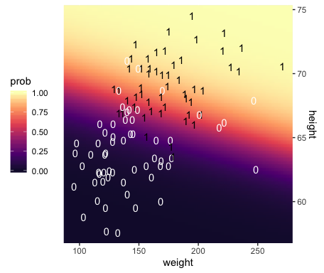<!-- -->

If you look way back to Figure 21.1, you’ll see the following formula at
the
top,

\[y \sim \operatorname{dbern} (m), m = \operatorname{logistic} (0.018 x_1 + 0.7 x_2 - 50).\]

Now while you keep your finger on that equation, take another look at
the last line in Kruschke’s Equation 21.1,

\[
\operatorname{logit} (\mu) = 
\underbrace{\zeta_0 - \sum_j \frac{\zeta_j}{s_{x_j}} \overline x_j}_{\beta_0} +
\sum_j \underbrace{\frac{\zeta_j}{s_{x_j}} \overline x_j}_{\beta_j},
\]

where the \(\zeta\)s are the parameters from the model based on
standardized predictors. Our `fit2` was based on standardized `weight`
and `height` values (i.e., `weight_z` and `height_z`), yielding model
coefficients in the \(\zeta\) metric. Here we use the formula above to
convert our `fit2` estimates to their unstandardized \(\beta\) metric.
For simplicity, we’ll just take their means.

``` r
posterior_samples(fit2) %>% 
  transmute(beta_0 = b_Intercept - ((b_weight_z * mean(my_data$weight) / sd(my_data$weight)) + 
                                      ((b_height_z * mean(my_data$height) / sd(my_data$height)))),
            beta_1 = b_weight_z / sd(my_data$weight),
            beta_2 = b_height_z / sd(my_data$height)) %>% 
  summarise_all(~mean(.) %>% round(., digits = 3))
```

    ##    beta_0 beta_1 beta_2
    ## 1 -49.713  0.019  0.699

Within rounding error, those values are the same ones in the formula at
the top of Kruschke’s Figure 21.1\! That is, our last plot was a version
of Figure 21.1.

Hopefully this helps make sense of what the thresholds in Figure 21.4.a
represented. But do note a major limitation of this visualization
approach. By expressing the threshold by multiple lines drawn from the
posterior in Figure 21.4.a, we expressed the uncertainty inherent in the
posterior distribution. However, for this probability plane approach,
we’ve taken a single value from the posterior, the mean (i.e., the
`Estimate`), to compute the probabilities. Though beautiful, our
probability-plane plot does a poor job expressing the uncertainty in the
model.

## Interpreting the regression coefficients

> In this section, I’ll discuss how to interpret the parameters in
> logistic regression. The first subsection explains how to interpret
> the numerical magnitude of the slope coefficients in terms of “log
> odds.” The next subsection shows how data with relatively few 1’s or
> 0’s can yield ambiguity in the parameter estimates. Then an example
> with strongly correlated predictors reveals tradeoffs in slope
> coefficients. Finally, I briefly describe the meaning of
> multiplicative interaction for logistic regression. (p. 629)

### Log odds.

> When the logistic regression formula is written using the logit
> function, we have
> \(\operatorname{logit} (\mu) = \beta_0 + \beta_1 x_1 + \beta_2 x_2\).
> The formula implies that whenever \(x_1\) goes up by 1 unit (on the
> \(x_1\) scale), then \(\operatorname{logit} (\mu)\) goes up by an
> amount \(\beta_1\). And whenever \(x_2\) goes up by 1 unit (on the
> \(x_2\) scale), then \(\operatorname{logit} (\mu)\) goes up by an
> amount \(\beta_2\). Thus, the regression coefficients are telling us
> about increases in \(\operatorname{logit} (\mu)\). To understand the
> regression coefficients, we need to understand
> \(\operatorname{logit} (\mu)\). (pp. 629–630)

Given the logit function is the inverse of the logistic, which itself is

\[\operatorname{logistic} (x) = \frac{1}{1 + \exp (−x)},\]

and given the
formula

\[\operatorname{logit} (\mu) = \log \bigg (\frac{\mu}{1 - \mu} \bigg), \]

where

\[0 < \mu < 1, \]

it may or may not be clear that the results of our logistic regression
models have a nonlinear relation with the actual parameter of interest,
\(\mu\), which, recall, is the probability our criterion variable is 1
(e.g., `male == 1`). To get a sense of that nonlinear relation, we might
make a plot.

``` r
tibble(mu         = seq(from = 0, to = 1, length.out = 200)) %>% 
  mutate(logit_mu = log(mu / (1 - mu))) %>% 

  ggplot(aes(x = mu, y = logit_mu)) +
  geom_line() +
  labs(x = expression(paste(mu, " (i.e., the probability space)")),
       y = expression(paste("logit (", mu, ") (i.e., the parameter space)"))) +
  theme(panel.grid      = element_blank(),
        legend.position = "none")
```

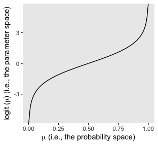<!-- -->

So whereas our probability space is bound between 0 and 1, the parameter
space shoots off into negative and positive infinity.
Also,

\[\operatorname{logit} (\mu) = \log \Bigg (\frac{p(y = 1)}{p(y = 0)} \Bigg )\]

Thus, “the ratio, \(p(y = 1) / p(y = 0)\), is called the odds of outcome
1 to outcome 0, and therefore \(\operatorname{logit} (\mu)\) is the log
odds of outcome 1 to outcome 0” (p. 630).

Here’s a tibble layout of the height/weight examples in the middle of
page 630.

``` r
tibble(b0     = -50,
       b1     = .02,
       b2     = .7,
       weight = 160,
       inches = c(63:64, 67:68)) %>% 
  mutate(logit_mu = b0 + b1 * weight + b2 * inches) %>%
  mutate(log_odds = logit_mu) %>% 
  mutate(p_male   = 1 / (1 + exp(-log_odds)))
```

    ## # A tibble: 4 x 8
    ##      b0    b1    b2 weight inches logit_mu log_odds p_male
    ##   <dbl> <dbl> <dbl>  <dbl>  <int>    <dbl>    <dbl>  <dbl>
    ## 1   -50  0.02   0.7    160     63   -2.7     -2.7   0.0630
    ## 2   -50  0.02   0.7    160     64   -2       -2     0.119 
    ## 3   -50  0.02   0.7    160     67    0.1      0.1   0.525 
    ## 4   -50  0.02   0.7    160     68    0.800    0.800 0.690

### When there are few 1’s or 0’s in the data.

> In logistic regression, you can think of the parameters as describing
> the boundary between the 0’s and the 1’s. If there are many 0’s and
> 1’s, then the estimate of the boundary parameters can be fairly
> accurate. But if there are few 0’s or few 1’s, the boundary can be
> difficult to identify very accurately, even if there are many data
> points overall. (p. 631)

As far as I can tell, Kruschke must have used \(n = 500\) to simulate
the data he displayed in Figure 21.5. Using the coefficient values he
displayed in the middle of page 631, here’s an attempt at replicating
them.

``` r
b0 <- -3
b1 <- 1

n <- 500

set.seed(21)
d_rare <-
  tibble(x  = rnorm(n, mean = 0, sd = 1)) %>% 
  mutate(mu = b0 + b1 * x) %>% 
  mutate(y  = rbinom(n, size = 1, prob = 1 / (1 + exp(-mu))))

glimpse(d_rare)
```

    ## Observations: 500
    ## Variables: 3
    ## $ x  <dbl> 0.793013171, 0.522251264, 1.746222241, -1.271336123, 2.197389533, 0.433130777, -1.5701…
    ## $ mu <dbl> -2.2069868, -2.4777487, -1.2537778, -4.2713361, -0.8026105, -2.5668692, -4.5701996, -3…
    ## $ y  <int> 1, 1, 0, 0, 0, 0, 0, 0, 0, 0, 0, 0, 0, 0, 0, 0, 0, 0, 0, 0, 0, 0, 0, 0, 0, 1, 0, 0, 0,…

We’re ready to fit the model. So far, we’ve been following along with
Kruschke by using the Bernoulli distribution (i.e., `family =
bernoulli`) in our **brms** models. Let’s get frisky and use the
\(n = 1\) binomial distribution, here. You’ll see it yields the same
results.

``` r
fit3 <-
  brm(data = d_rare, 
      family = binomial,
      y | trials(1) ~ 1 + x,
      prior = c(prior(normal(0, 2), class = Intercept),
                prior(normal(0, 2), class = b)),
      iter = 2500, warmup = 500, chains = 4, cores = 4,
      seed = 21)
```

Recall that when you use the binomial distribution in newer versions of
**brms**, you need to use the `trials()` syntax to tell `brm()` how many
trials each row in the data corresponds to. Anyway, behold the summary.

``` r
print(fit3)
```

    ##  Family: binomial 
    ##   Links: mu = logit 
    ## Formula: y | trials(1) ~ 1 + x 
    ##    Data: d_rare (Number of observations: 500) 
    ## Samples: 4 chains, each with iter = 2500; warmup = 500; thin = 1;
    ##          total post-warmup samples = 8000
    ## 
    ## Population-Level Effects: 
    ##           Estimate Est.Error l-95% CI u-95% CI Rhat Bulk_ESS Tail_ESS
    ## Intercept    -3.01      0.24    -3.50    -2.56 1.00     2895     3993
    ## x             1.03      0.20     0.63     1.43 1.00     3047     3790
    ## 
    ## Samples were drawn using sampling(NUTS). For each parameter, Eff.Sample 
    ## is a crude measure of effective sample size, and Rhat is the potential 
    ## scale reduction factor on split chains (at convergence, Rhat = 1).

Looks like the model did a good job recapturing those data-generating
`b0` and `b1` values. Here’s the preparatory work to needed before we
can make our version of the main plot in Figure 21.5.a.

``` r
# unclear if Kruschke still used 20 draws or not
# perhaps play with `n_iter` values.
n_iter <- 20
length <- 100

nd <- tibble(x = seq(from = -3.5, to = 3.5, length.out = length))

# these will make the logistic curves
set.seed(21)
f <-
  fitted(fit3,
         newdata  = nd,
         summary  = F,
         nsamples = n_iter) %>% 
  as_tibble() %>%
  pivot_longer(everything(), 
               values_to = "y") %>% 
  mutate(x    = rep(nd$x, times = n_iter),
         iter = rep(1:n_iter, each = length))

# Here's just a little more work to get the thresholds
thresholds <-
  f %>% 
  filter(y < .5) %>% 
  group_by(iter) %>% 
  filter(y == max(y))
```

We’re ready to plot the top left panel of Figure 21.5.

``` r
f %>%   
  ggplot(aes(x = x, y = y)) +
  geom_hline(yintercept = .5, color = "white") +
  geom_vline(xintercept = thresholds$x, color = "white", size = 2/5) +
  geom_line(aes(group = iter),
            color = "grey50", alpha = 2/3, size = 1/3) +
  geom_point(data = d_rare,
             alpha = 1/5) +
  scale_x_continuous(breaks = -3:3) +
  ggtitle("Data with Post. Pred.") +
  coord_cartesian(xlim = -3:3) +
  theme(panel.grid = element_blank())
```

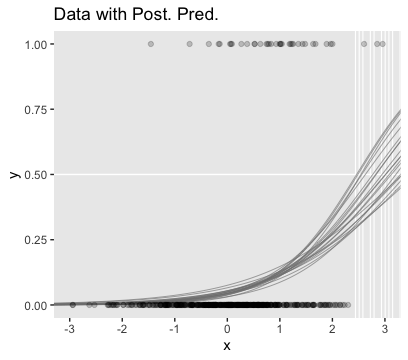<!-- -->

Here are the two subplots at the bottom, left.

``` r
posterior_samples(fit3) %>% 
  transmute(Intercept = b_Intercept,
            x         = b_x) %>% 
  pivot_longer(everything()) %>% 
  
  ggplot(aes(x = value)) +
  geom_histogram(color = "grey92", fill = "grey67",
                 size = .2, bins = 40) +
  stat_pointintervalh(aes(y = 0),
                      point_interval = mode_hdi, .width = c(.95, .5)) +
  scale_y_continuous(NULL, breaks = NULL) +
  xlab(NULL) +
  theme(panel.grid = element_blank()) +
  facet_wrap(~name, scales = "free", ncol = 2)
```

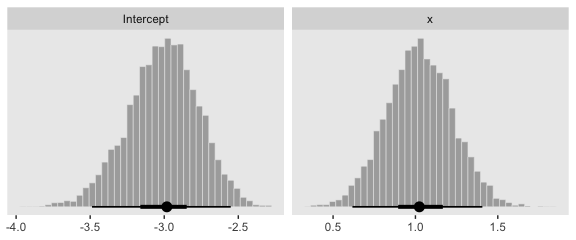<!-- -->

Since our data were simulated without the benefit of knowing how
Kruschke set his seed and such, our results will only approximate those
in the text.

Okay, now we need to simulate the complimentary data, those for which
\(y = 1\) is a less-rare event.

``` r
b0 <- 0
b1 <- 1

n <- 500

set.seed(21)
d_not_rare <-
  tibble(x  = rnorm(n, mean = 0, sd = 1)) %>% 
  mutate(mu = b0 + b1 * x) %>% 
  mutate(y  = rbinom(n, size = 1, prob = 1 / (1 + exp(-mu))))

glimpse(d_not_rare)
```

    ## Observations: 500
    ## Variables: 3
    ## $ x  <dbl> 0.793013171, 0.522251264, 1.746222241, -1.271336123, 2.197389533, 0.433130777, -1.5701…
    ## $ mu <dbl> 0.793013171, 0.522251264, 1.746222241, -1.271336123, 2.197389533, 0.433130777, -1.5701…
    ## $ y  <int> 0, 0, 1, 0, 1, 1, 0, 0, 0, 1, 0, 1, 1, 1, 0, 1, 1, 1, 0, 0, 1, 1, 0, 1, 0, 0, 0, 0, 1,…

Fitting this model is just like before.

``` r
fit4 <-
  update(fit3,
         newdata = d_not_rare)
```

Behold the summary.

``` r
print(fit4)
```

    ##  Family: binomial 
    ##   Links: mu = logit 
    ## Formula: y | trials(1) ~ 1 + x 
    ##    Data: d_not_rare (Number of observations: 500) 
    ## Samples: 4 chains, each with iter = 2500; warmup = 500; thin = 1;
    ##          total post-warmup samples = 8000
    ## 
    ## Population-Level Effects: 
    ##           Estimate Est.Error l-95% CI u-95% CI Rhat Bulk_ESS Tail_ESS
    ## Intercept     0.08      0.10    -0.11     0.27 1.00     7326     5296
    ## x             0.90      0.11     0.68     1.12 1.00     5510     5018
    ## 
    ## Samples were drawn using sampling(NUTS). For each parameter, Eff.Sample 
    ## is a crude measure of effective sample size, and Rhat is the potential 
    ## scale reduction factor on split chains (at convergence, Rhat = 1).

Here’s the main plot in Figure 21.5.b.

``` r
nd <- tibble(x = seq(from = -3.5, to = 3.5, length.out = length))

set.seed(21)
f <-
  fitted(fit4,
         newdata = nd,
         summary = F,
         nsamples = n_iter) %>% 
  as_tibble() %>% 
  pivot_longer(everything(), 
               values_to = "y") %>% 
  mutate(x    = rep(nd$x, times = n_iter),
         iter = rep(1:n_iter, each = length))

thresholds <-
  f %>% 
  filter(y < .5) %>% 
  group_by(iter) %>% 
  filter(y == max(y))

f %>%   
  ggplot(aes(x = x, y = y)) +
  geom_hline(yintercept = .5, color = "white") +
  geom_vline(xintercept = thresholds$x, color = "white", size = 2/5) +
  geom_line(aes(group = iter),
            color = "grey50", alpha = 2/3, size = 1/3) +
  geom_point(data = d_not_rare,
             aes(y = y),
             alpha = 1/5) +
  ggtitle("Data with Post. Pred.") +
  coord_cartesian(xlim = -3:3) +
  theme(panel.grid = element_blank())
```

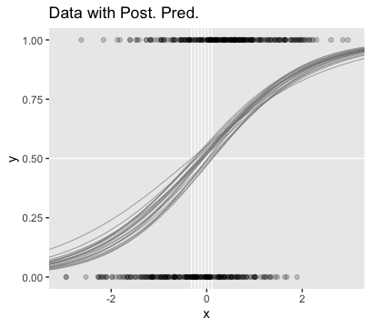<!-- -->

Behold the subplots at the bottom.

``` r
posterior_samples(fit4) %>% 
  transmute(Intercept = b_Intercept,
            x         = b_x) %>% 
  pivot_longer(everything()) %>% 
  
  ggplot(aes(x = value)) +
  geom_histogram(color = "grey92", fill = "grey67",
                 size = .2, bins = 40) +
  stat_pointintervalh(aes(y = 0),
                      point_interval = mode_hdi, .width = c(.95, .5)) +
  scale_y_continuous(NULL, breaks = NULL) +
  xlab(NULL) +
  theme(panel.grid = element_blank()) +
  facet_wrap(~name, scales = "free", ncol = 2)
```

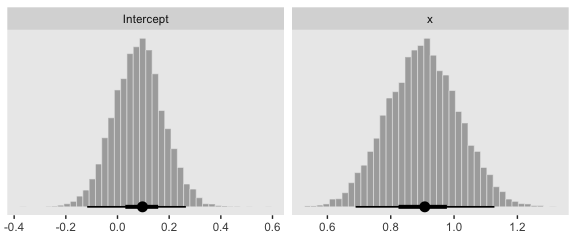<!-- -->

> You can see in Figure 21.5 that the estimate of the slope (and of the
> intercept) is more certain in the right panel than in the left panel.
> The 95% HDI on the slope, \(\beta_1\), is much wider in the left panel
> than in the right panel, and you can see that the logistic curves in
> the left panel have greater variation in steepness than the logistic
> curves in the right panel. The analogous statements hold true for the
> intercept parameter.
> 
> Thus, if you are doing an experimental study and you can manipulate
> the \(x\) values, you will want to select \(x\) values that yield
> about equal numbers of 0’s and 1’s for the \(y\) values overall. If
> you are doing an observational study, such that you cannot control any
> independent variables, then you should be aware that the parameter
> estimates may be surprisingly ambiguous if your data have only a small
> proportion of 0’s or 1’s. (pp. 631–632)

### Correlated predictors.

“Another important cause of parameter uncertainty is correlated
predictors. This issue was previously discussed at length, but the
context of logistic regression provides novel illustration in terms of
level contours” (p. 632).

As far as I can tell, Kruschke chose about \(n = 200\) for the data in
this example. After messing around with correlations for a bit, it seems
\(\rho_{x_1, x_2} = .975\) looks about right. To my knowledge, the best
way to simulate multivariate Gaussian data with a particular correlation
is with the [`MASS::mvrnorm()`
function](https://www.rdocumentation.org/packages/MASS/versions/7.3-51.1/topics/mvrnorm).
Since we’ll be using standardized \(x\)-variables, we’ll need to specify
our \(n\), the desired correlation matrix, and a vector of means. Then
we’ll be ready to do the actual simulation with `mvrnorm()`.

``` r
n <- 200

# correlation matrix
s <- matrix(c(1, .975, 
              .975, 1), 
            nrow = 2, ncol = 2)

# mean vector
m <- c(0, 0)

# simulate
set.seed(21)
d <- 
  MASS::mvrnorm(n = n, mu = m, Sigma = s) %>%
  as_tibble() %>% 
  set_names(str_c("x", 1:2))
```

Let’s confirm their correlation coefficient.

``` r
cor(d)
```

    ##           x1        x2
    ## x1 1.0000000 0.9730091
    ## x2 0.9730091 1.0000000

Solid. Now we’ll use the \(\beta\) values from page 633 to simulate the
data set by including our dichotomous criterion variable, `y`.

``` r
b0 <- 0
b1 <- 1
b2 <- 1

set.seed(21)
d <-
  d %>% 
  mutate(mu = b0 + b1 * x1 + b2 * x2) %>% 
  mutate(y  = rbinom(n, size = 1, prob = 1 / (1 + exp(-mu))))
```

Fit the model with the highly-correlated predictors.

``` r
fit5 <-
  brm(data = d, 
      family = binomial,
      y | trials(1) ~ 1 + x1 + x2,
      prior = c(prior(normal(0, 2), class = Intercept),
                prior(normal(0, 2), class = b)),
      iter = 2500, warmup = 500, chains = 4, cores = 4,
      seed = 21)
```

Behold the summary.

``` r
print(fit5)
```

    ##  Family: binomial 
    ##   Links: mu = logit 
    ## Formula: y | trials(1) ~ 1 + x1 + x2 
    ##    Data: d (Number of observations: 200) 
    ## Samples: 4 chains, each with iter = 2500; warmup = 500; thin = 1;
    ##          total post-warmup samples = 8000
    ## 
    ## Population-Level Effects: 
    ##           Estimate Est.Error l-95% CI u-95% CI Rhat Bulk_ESS Tail_ESS
    ## Intercept    -0.04      0.18    -0.39     0.31 1.00     4473     3670
    ## x1           -0.05      0.72    -1.45     1.35 1.00     3422     3386
    ## x2            2.07      0.78     0.61     3.64 1.00     3461     3472
    ## 
    ## Samples were drawn using sampling(NUTS). For each parameter, Eff.Sample 
    ## is a crude measure of effective sample size, and Rhat is the potential 
    ## scale reduction factor on split chains (at convergence, Rhat = 1).

We did a good job recapturing Kruschke’s \(\beta\)s in terms of our
posterior means, but notice how large those posterior \(SD\)s are for
\(\beta_1\) and \(\beta_2\). To get a better sense, let’s look at them
in a coefficient plot before continuing on with the text.

``` r
posterior_samples(fit5) %>% 
  pivot_longer(-lp__) %>% 
  
  ggplot(aes(x = value, y = name)) +
  stat_pointintervalh(point_interval = mode_hdi, .width = c(.5, .95)) +
  labs(x = NULL, y = NULL) +
  theme(panel.grid   = element_blank(),
        axis.ticks.y = element_blank(),
        axis.text.y  = element_text(hjust = 0))
```

<!-- -->

Them are some sloppy estimates\! But we digress. Here’s our version of
Figure 21.6.a.

``` r
set.seed(21)  # we need this for the `sample_n()` function
posterior_samples(fit5) %>% 
  mutate(iter = 1:n()) %>% 
  sample_n(size = 20) %>% 
  expand(nesting(iter, b_Intercept, b_x1, b_x2),
         x1 = c(-4, 4)) %>% 
  # this follows the equation near the top of p. 629
  mutate(x2 = (-b_Intercept / b_x2) + (-b_x1 / b_x2) * x1) %>% 
  
  # now plot
  ggplot(aes(x = x1, y = x2)) +
  geom_line(aes(group = iter),
            color = "white", size = 2/5) +
  geom_text(data = d,
            aes(label = y, color = y == 1),
            size = 2.5) +
  scale_color_manual(values = c("red4", "blue4")) +
  ggtitle("Data with Post. Pred.") +
  coord_cartesian(xlim = -3:3,
                  ylim = -3:3) +
  theme(panel.grid      = element_blank(),
        legend.position = "none")
```

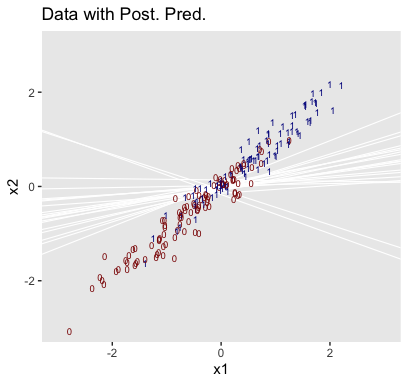<!-- -->

It can be easy to under-appreciate how sensitive this plot is to the
seed you set for `sample_n()`. To give a better sense of the uncertainty
in the posterior for the threshold, here we show the plot for several
different seeds.

``` r
# make a custom function
different_seed <- function(i) {
  
  set.seed(i)
  posterior_samples(fit5) %>% 
  mutate(iter = 1:n()) %>% 
  sample_n(size = 20) %>% 
  expand(nesting(iter, b_Intercept, b_x1, b_x2),
         x1 = c(-4, 4)) %>% 
  mutate(x2 = (-b_Intercept / b_x2) + (-b_x1 / b_x2) * x1)
  
}

# specify your seeds
tibble(seed = 1:9) %>% 
  # pump those seeds into the `different_seed()` function
  mutate(sim = map(seed, different_seed)) %>% 
  unnest(sim) %>% 
  mutate(seed = str_c("seed: ", seed)) %>% 
  
  # plot
  ggplot(aes(x = x1, y = x2)) +
  geom_line(aes(group = iter),
            color = "white", size = 1/3) +
  geom_text(data = d,
            aes(label = y, color = y == 1),
            size = 1.5) +
  scale_color_manual(values = c("red4", "blue4")) +
  ggtitle("Data with Post. Pred.") +
  coord_cartesian(xlim = -3:3,
                  ylim = -3:3) +
  theme(panel.grid      = element_blank(),
        legend.position = "none") +
  facet_wrap(~seed)
```

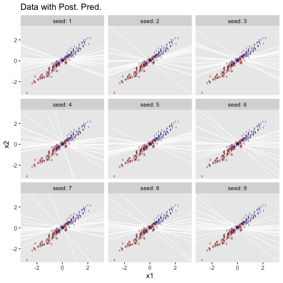<!-- -->

We’ll use `pairs()` to make our version of Figure 21.6.b.

``` r
pairs(fit5,
      off_diag_args = list(size = 1/5, alpha = 1/5))
```

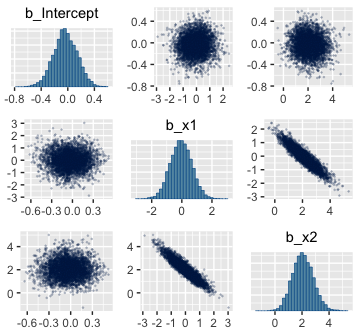<!-- -->

Finally, here are the Pearson’s correlations among the model parameters.

``` r
posterior_samples(fit5) %>%
  select(-lp__) %>%
  cor() %>%
  round(digits = 3)
```

    ##             b_Intercept   b_x1   b_x2
    ## b_Intercept       1.000  0.010 -0.028
    ## b_x1              0.010  1.000 -0.928
    ## b_x2             -0.028 -0.928  1.000

### Interaction of metric predictors.

Kruschke didn’t walk through an analysis in this section, but it’s worth
the practice. Let’s simulate data based on the formula he gave in Figure
21.7, top right.

``` r
n  <- 500

b0 <- 0
b1 <- 0
b2 <- 0
b3 <- 4

set.seed(21)
d <-
  tibble(x1 = rnorm(n, mean = 0, sd = 1),
         x2 = rnorm(n, mean = 0, sd = 1)) %>% 
  mutate(mu = b1 * x1 + b2 * x2 + b3 * x1 * x2 - b0) %>% 
  mutate(y  = rbinom(n, size = 1, prob = 1 / (1 + exp(-mu))))
```

To fit the interaction model, let’s go back to the Bernoulli likelihood.

``` r
fit6 <-
  brm(data = d, 
      family = bernoulli,
      y ~ 1 + x1 + x2 + x1:x2,
      prior = c(prior(normal(0, 2), class = Intercept),
                prior(normal(0, 2), class = b)),
      iter = 2500, warmup = 500, chains = 4, cores = 4,
      seed = 21)
```

Looks like the model did a nice job recapturing the data-generating
parameters.

``` r
print(fit6)
```

    ##  Family: bernoulli 
    ##   Links: mu = logit 
    ## Formula: y ~ 1 + x1 + x2 + x1:x2 
    ##    Data: d (Number of observations: 500) 
    ## Samples: 4 chains, each with iter = 2500; warmup = 500; thin = 1;
    ##          total post-warmup samples = 8000
    ## 
    ## Population-Level Effects: 
    ##           Estimate Est.Error l-95% CI u-95% CI Rhat Bulk_ESS Tail_ESS
    ## Intercept    -0.18      0.12    -0.42     0.06 1.00     9164     6145
    ## x1           -0.21      0.17    -0.53     0.11 1.00     9497     6131
    ## x2           -0.02      0.16    -0.35     0.30 1.00     8567     5382
    ## x1:x2         4.27      0.44     3.44     5.15 1.00     7391     5543
    ## 
    ## Samples were drawn using sampling(NUTS). For each parameter, Eff.Sample 
    ## is a crude measure of effective sample size, and Rhat is the potential 
    ## scale reduction factor on split chains (at convergence, Rhat = 1).

I’m not quite sure how to expand Kruschke’s equation from the top of
page 629 to our interaction model. But no worries. We can take a
slightly different approach to show the consequences of our interaction
model on the probability \(y = 1\). First, we define our `newdata` and
then get the `Estimate`s from `fitted()`. Then we wrangle as usual.

``` r
length <- 100

nd <- 
  crossing(x1 = seq(from = -3.5, to = 3.5, length.out = length),
           x2 = seq(from = -3.5, to = 3.5, length.out = length))

f <-
  fitted(fit6,
         newdata = nd,
         scale = "linear") %>% 
  as_tibble() %>% 
  transmute(prob = Estimate %>% inv_logit_scaled())
```

Now all we have to do is integrate our `f` results with the `nd` and
original `d` data and then we can plot.

``` r
f %>% 
  bind_cols(nd) %>% 
  
  ggplot(aes(x = x1, y = x2)) +
  geom_raster(aes(fill = prob),
              interpolate = T) +
  geom_text(data = d,
            aes(label = y, color = y == 1),
            size = 2.75, show.legend = F) +
  scale_color_manual(values = c("white", "black")) +
  scale_fill_viridis_c(option = "A", begin = .15, limits = c(0, 1)) +
  scale_x_continuous(expand = c(0, 0)) +
  scale_y_continuous(expand = c(0, 0)) +
  coord_cartesian(xlim = range(nd$x1),
                  ylim = range(nd$x2))
```

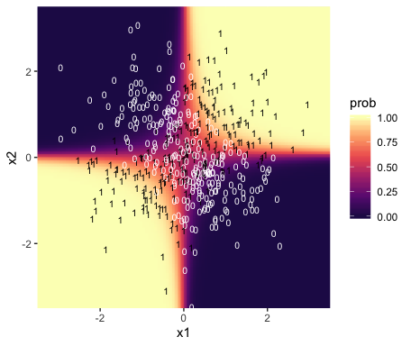<!-- -->

Instead of a simple threshold line, we get to visualize our interaction
as a checkerboard-like probability plane.

## Robust logistic regression

With the robust logistic regression approach,

> we will describe the data as being a mixture of two different sources.
> One source is the logistic function of the predictor(s). The other
> source is sheer randomness or “guessing,” whereby the \(y\) value
> comes from the flip of a fair coin:
> \(y \sim \operatorname{Bernoulli} (\mu = 1/2)\). We suppose that every
> data point has a small chance, \(\alpha\), of being generated by the
> guessing process, but usually, with probability \(1 - \alpha\), the
> \(y\) value comes from the logistic function of the predictor. With
> the two sources combined, the predicted probability that \(y = 1\)
> is
> 
> \[\mu = \alpha \cdot \frac{1}{2} + (1 - \alpha) \cdot \operatorname{logistic} \bigg ( \beta_0  + \sum_j \beta_j x_j \bigg )\]
> 
> Notice that when the guessing coefficient is zero, then the
> conventional logistic model is completely recovered. When the guessing
> coefficient is one, then the y values are completely random. (p. 635)

Here’s what Kruschke’s `beta(1, 9)` prior for \(\alpha\) looks like.

``` r
tibble(x = seq(from = 0, to = 1, length.out = 200)) %>% 
  
  ggplot(aes(x = x)) +
  # check out this `ymax` trick?
  geom_ribbon(aes(ymin = 0, ymax = dbeta(x, 1, 9)),
              size = 0, fill = "grey50") +
  scale_y_continuous(NULL, breaks = NULL) +
  labs(title = "beta(1, 9)", 
       x     = NULL) +
  theme(panel.grid = element_blank())
```

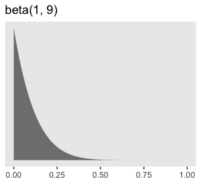<!-- -->

To fit the **brms** analogue to Kruschke’s rogust logistic regression
model, we’ll need to adopt what Bürkner calls the non-linear syntax,
which you can learn about in detail with his vignette, [*Estimating
Non-Linear Models with
brms*](https://cran.r-project.org/web/packages/brms/vignettes/brms_nonlinear.html).

``` r
fit7 <-
  brm(data = my_data, 
      family = bernoulli(link = identity),
      bf(male ~ a * .5 + (1 - a) * 1 / (1 + exp(-1 * (b0 + b1 * weight_z))),
         a + b0 + b1  ~ 1,
         nl = TRUE),
      prior = c(prior(normal(0, 2), nlpar = "b0"),
                prior(normal(0, 2), nlpar = "b1"),
                prior(beta(1, 9),   nlpar = "a")),
      iter = 2500, warmup = 500, chains = 4, cores = 4,
      seed = 21)
```

And just for clarity, you can do the same thing with `family =
binomial(link = identity)`, too. Just don’t forget to specify the number
of trials with `trials()`. But to explain what’s going on with our
syntax, above, I think it’s best to quote Bürkner at length:

> When looking at the above code, the first thing that becomes obvious
> is that we changed the `formula` syntax to display the non-linear
> formula including predictors (i.e., \[`weight_z`\]) and parameters
> (i.e., \[`a`, `b0`, and `b1`\]) wrapped in a call to \[the `bf()`
> function\]. This stands in contrast to classical **R** formulas, where
> only predictors are given and parameters are implicit. The argument
> \[`a + b0 + b1 ~ 1`\] serves two purposes. First, it provides
> information, which variables in `formula` are parameters, and second,
> it specifies the linear predictor terms for each parameter. In fact,
> we should think of non-linear parameters as placeholders for linear
> predictor terms rather than as parameters themselves (see also the
> following examples). In the present case, we have no further variables
> to predict \[`a`, `b0`, and `b1`\] and thus we just fit intercepts
> that represent our estimates of \[\(\alpha\), \(\beta_0\), and
> \(\beta_1\)\]. The formula \[`a + b0 + b1 ~ 1`\] is a short form of
> \[`a ~ 1, b0 ~ 1, b1 ~ 1`\] that can be used if multiple non-linear
> parameters share the same formula. Setting `nl = TRUE` tells **brms**
> that the formula should be treated as non-linear.
> 
> In contrast to generalized linear models, priors on population-level
> parameters (i.e., ‘fixed effects’) are often mandatory to identify a
> non-linear model. Thus, **brms** requires the user to explicitely
> specify these priors. In the present example, we used a \[`beta(1, 9)`
> prior on (the population-level intercept of) `a`, while we used a
> `normal(0, 4)` prior on both (population-level intercepts of) `b0` and
> `b1`\]. Setting priors is a non-trivial task in all kinds of models,
> especially in non-linear models, so you should always invest some time
> to think of appropriate priors. Quite often, you may be forced to
> change your priors after fitting a non-linear model for the first
> time, when you observe different MCMC chains converging to different
> posterior regions. This is a clear sign of an idenfication problem and
> one solution is to set stronger (i.e., more narrow) priors.
> (**emphasis** in the original)

Now, behold the
    summary.

``` r
print(fit7)
```

    ## Warning: There were 632 divergent transitions after warmup. Increasing adapt_delta above 0.8 may help.
    ## See http://mc-stan.org/misc/warnings.html#divergent-transitions-after-warmup

    ##  Family: bernoulli 
    ##   Links: mu = identity 
    ## Formula: male ~ a * 0.5 + (1 - a) * 1/(1 + exp(-1 * (b0 + b1 * weight_z))) 
    ##          a ~ 1
    ##          b0 ~ 1
    ##          b1 ~ 1
    ##    Data: my_data (Number of observations: 110) 
    ## Samples: 4 chains, each with iter = 2500; warmup = 500; thin = 1;
    ##          total post-warmup samples = 8000
    ## 
    ## Population-Level Effects: 
    ##              Estimate Est.Error l-95% CI u-95% CI Rhat Bulk_ESS Tail_ESS
    ## a_Intercept      0.20      0.09     0.04     0.39 1.00     2541     2843
    ## b0_Intercept     0.34      0.45    -0.41     1.39 1.00     3505     3195
    ## b1_Intercept     2.64      0.87     1.14     4.53 1.00     2539     3349
    ## 
    ## Samples were drawn using sampling(NUTS). For each parameter, Eff.Sample 
    ## is a crude measure of effective sample size, and Rhat is the potential 
    ## scale reduction factor on split chains (at convergence, Rhat = 1).

It turns out Bürkner’s warning on “different posterior regions” applied
to our case. While preparing this document, I played around with higher
`adapt_delta` values, as suggested in the warning message. The model
showed problems even at `adapt_delta = 0.999`. Here, our main purpose is
to ape Kruschke. But if this was a substantive model of interest, I’d
suggest following Bürkner’s advice and think hard about specifying
narrower priors.

Anyway, here’s a quick and dirty look at the marginal effects for
`weight_z`.

``` r
conditional_effects(fit7) %>% 
  plot(points = T)
```

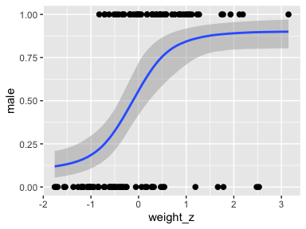<!-- -->

The way we prep for our version of Figure 21.8 is just the same as what
we did for Figure 21.3, above.

``` r
length <- 200

nd <- tibble(weight_z = seq(from = -2, to = 3.5, length.out = length))

f <-
  fitted(fit7,
         newdata = nd,
         summary = F,
         nsamples = n_iter) %>% 
  as_tibble() %>% 
  mutate(iter = 1:n_iter) %>% 
  pivot_longer(-iter) %>% 
  mutate(weight_z = rep(nd$weight_z, times = n_iter)) %>% 
  mutate(weight   = weight_z * sd(my_data$weight) + mean(my_data$weight))

thresholds <-
  f %>% 
  filter(value < .5) %>% 
  group_by(iter) %>% 
  filter(value == max(value))
```

Now plot.

``` r
f %>% 
  ggplot(aes(x = weight, y = value)) +
  geom_hline(yintercept = .5, color = "white", size = 1/2) +
  geom_vline(xintercept = thresholds$weight, color = "white", size = 2/5) +
  geom_line(aes(group = iter),
            color = "grey50", size = 1/3, alpha = 2/3) +
  geom_point(data = my_data,
             aes(y = male),
             alpha = 1/3) +
  labs(title = "Data with Post. Pred.", 
       y     = "male") +
  coord_cartesian(xlim = range(my_data$weight)) +
  theme(panel.grid = element_blank())
```

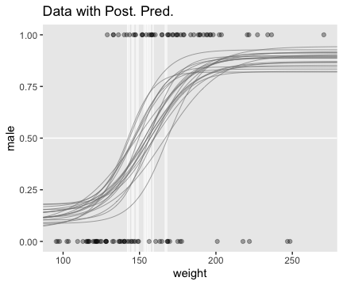<!-- -->

Here we show the marginal distributions in our versions of the lower
panels of Figure 21.8.

``` r
posterior_samples(fit7) %>% 
  transmute(Intercept = b_b0_Intercept - (b_b1_Intercept * mean(my_data$weight) / sd(my_data$weight)),
            weight    = b_b1_Intercept / sd(my_data$weight),
            guessing  = b_a_Intercept) %>% 
  pivot_longer(everything()) %>% 
  mutate(name = factor(name, levels = c("Intercept", "weight", "guessing"))) %>% 
  
  ggplot(aes(x = value)) +
  geom_histogram(color = "grey92", fill = "grey67",
                 size = .2, bins = 40) +
  stat_pointintervalh(aes(y = 0),
                      point_interval = mode_hdi, .width = c(.95, .5)) +
  scale_y_continuous(NULL, breaks = NULL) +
  xlab(NULL) +
  theme(panel.grid = element_blank()) +
  facet_wrap(~name, scales = "free", ncol = 3)
```

<!-- -->

Here are the `pairs()` plots.

``` r
pairs(fit7,
      off_diag_args = list(size = 1/5, alpha = 1/5))
```

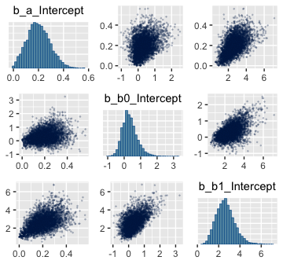<!-- -->

Look at how that sweet Stan-based HMC reduced the correlation between
\(\beta_0\) and \(\beta_1\).

For more on this approach to robust logistic regression in **brms** and
an alternative suggested by Andrew Gelman, check out a thread from the
Stan Forums, [*Translating robust logistic regression from rstan to
brms*](https://discourse.mc-stan.org/t/translating-robust-logistic-regression-from-rstan-to-brms/5244).

## Nominal predictors

“We now turn our attention from metric predictors to nominal predictors”
(p. 636).

### Single group.

If we have just a single group and no other predictors, that’s just an
intercept-only model. Back in the earlier chapters we thought of such a
model as

Now we’re expressing the model as

For that \(\beta_0\), we typically use a Gaussian prior of the form

\[\beta_0 \sim \operatorname{Normal} (M_0, S_0).\]

In a situation where we don’t have strong prior substantive knowledge,
we often set \(M_0 = 0\), which puts the probability mass around
\(\theta = .5\), a reasonable default hypothesis. Often times \(S_0\) is
some modest single-digit integer like 2 or 4. To get a sense of how
different Gaussians translate to the beta distribution, we’ll recreate
Figure 21.11.

``` r
# this will help streamline the conversion
logistic <- function(x) {
  1 / (1 + exp(-x))
}

# wrangle
crossing(m_0 = 0:1,
         s_0 = c(.5, 1, 2)) %>% 
  mutate(key = str_c("mu == logistic(beta %~%", " N(", m_0, ", ", s_0, "))"),
         sim = pmap(list(2e6, m_0, s_0), rnorm)) %>% 
  unnest(sim) %>% 
  mutate(sim = logistic(sim)) %>% 
  
  # plot
  ggplot(aes(x = sim,
             y = ..density..)) +
  geom_histogram(color = "grey92", fill = "grey67",
                 size = 1/3, bins = 20, boundary = 0) +
  geom_line(stat = "density", size = 3/4) +
  scale_y_continuous(NULL, breaks = NULL) +
  xlab(expression(mu)) +
  theme(panel.grid = element_blank()) +
  facet_wrap(~key, scales = "free_y", labeller = label_parsed)
```

<!-- -->

So the prior distribution doesn’t even flatten out until you’re
somewhere between \(S_0 = 1\) and \(S_0 = 2\). Just for kicks, here we
break that down a little further.

``` r
# wrangle
tibble(m_0 = 0,
       s_0 = c(1.25, 1.5, 1.75)) %>% 
  mutate(key = str_c("mu == logistic(beta %~%", " N(", m_0, ", ", s_0, "))"),
         sim = pmap(list(1e7, m_0, s_0), rnorm)) %>% 
  unnest(sim) %>% 
  mutate(sim = logistic(sim)) %>% 
  
  # plot
  ggplot(aes(x = sim,
             y = ..density..)) +
  geom_histogram(color = "grey92", fill = "grey67",
                 size = 1/3, bins = 20, boundary = 0) +
  geom_line(stat = "density", size = 3/4) +
  scale_y_continuous(NULL, breaks = NULL) +
  xlab(expression(mu)) +
  theme(panel.grid = element_blank()) +
  facet_wrap(~key, scales = "free_y", labeller = label_parsed, ncol = 3)
```

<!-- -->

Here’s the basic **brms** analogue to Kruschke’s JAGS code from the
bottom of page 639.

``` r
fit <-
  brm(data = my_data, 
      family = bernoulli(link = identity),
      y ~ 1,
      prior(beta(1, 1), class = Intercept))
```

Here’s the **brms** analogue to Kruschke’s JAGS code at the top of page
641.

``` r
fit <-
  brm(data = my_data, 
      family = bernoulli,
      y ~ 1,
      prior(normal(0, 2), class = "Intercept"))
```

### Multiple groups.

If there’s only one group, we don’t need a grouping variable. But that’s
a special case. Now we show the more general approach with multiple
groups.

#### Example: Baseball again.

Load the baseball
data.

``` r
my_data <- read_csv("/Users/solomon/Dropbox/Recoding Doing Bayesian Data Analysis/data.R/BattingAverage.csv")

glimpse(my_data)
```

    ## Observations: 948
    ## Variables: 6
    ## $ Player       <chr> "Fernando Abad", "Bobby Abreu", "Tony Abreu", "Dustin Ackley", "Matt Adams",…
    ## $ PriPos       <chr> "Pitcher", "Left Field", "2nd Base", "2nd Base", "1st Base", "Pitcher", "Pit…
    ## $ Hits         <dbl> 1, 53, 18, 137, 21, 0, 0, 2, 150, 167, 0, 128, 66, 3, 1, 81, 180, 36, 150, 0…
    ## $ AtBats       <dbl> 7, 219, 70, 607, 86, 1, 1, 20, 549, 576, 1, 525, 275, 12, 8, 384, 629, 158, …
    ## $ PlayerNumber <dbl> 1, 2, 3, 4, 5, 6, 7, 8, 9, 10, 11, 12, 13, 14, 15, 16, 17, 18, 19, 20, 21, 2…
    ## $ PriPosNumber <dbl> 1, 7, 4, 4, 3, 1, 1, 3, 3, 4, 1, 5, 4, 2, 7, 4, 6, 8, 9, 1, 2, 5, 1, 1, 7, 2…

#### The model.

I’m not aware that Kruschke’s modeling approach, here, will work well
within the brms paradigm. I suggest we fit a simple hierarchical
logistic regression model, instead. With this approach, we use the
statistical model

Here’s how to fit the model with **brms**. Notice we’re finally making
good use of the `trials()` syntax. This is because we’re fitting an
aggregated binomial model. Instead of our criterion variable `Hits`
being a vector of 0s and 1s, it’s the number of successful trials given
the total number of trials, which is listed in the `AtBats` vector.
Aggregated binomial.

``` r
fit8 <-
  brm(data = my_data,
      family = binomial(link = "logit"),
      Hits | trials(AtBats) ~ 1 + (1 | PriPos) + (1 | PriPos:Player),
      prior = c(prior(normal(0, 2), class = Intercept),
                prior(cauchy(0, 1), class = sd)),
      iter = 2500, warmup = 500, chains = 4, cores = 4,
      seed = 21)
```

#### Results.

Before we start plotting, review the model summary.

``` r
print(fit8)
```

    ##  Family: binomial 
    ##   Links: mu = logit 
    ## Formula: Hits | trials(AtBats) ~ 1 + (1 | PriPos) + (1 | PriPos:Player) 
    ##    Data: my_data (Number of observations: 948) 
    ## Samples: 4 chains, each with iter = 2500; warmup = 500; thin = 1;
    ##          total post-warmup samples = 8000
    ## 
    ## Group-Level Effects: 
    ## ~PriPos (Number of levels: 9) 
    ##               Estimate Est.Error l-95% CI u-95% CI Rhat Bulk_ESS Tail_ESS
    ## sd(Intercept)     0.32      0.10     0.19     0.57 1.00     2590     3901
    ## 
    ## ~PriPos:Player (Number of levels: 948) 
    ##               Estimate Est.Error l-95% CI u-95% CI Rhat Bulk_ESS Tail_ESS
    ## sd(Intercept)     0.14      0.01     0.12     0.15 1.00     3978     5910
    ## 
    ## Population-Level Effects: 
    ##           Estimate Est.Error l-95% CI u-95% CI Rhat Bulk_ESS Tail_ESS
    ## Intercept    -1.17      0.11    -1.40    -0.94 1.00     1696     2634
    ## 
    ## Samples were drawn using sampling(NUTS). For each parameter, Eff.Sample 
    ## is a crude measure of effective sample size, and Rhat is the potential 
    ## scale reduction factor on split chains (at convergence, Rhat = 1).

If you look closely at our model versus the one in the text, you’ll see
ours has fewer parameters. As a down-the-line consequence, our model
doesn’t support a direct analogue to the plot at the top of Figure
21.13. However, we can come close. Rather than modeling the
position-based probabilities as multiple draws of beta distributions, we
can simply summarize our probabilities by their posterior distributions.

``` r
library(ggridges)

# define our new data, `nd`
nd <- 
  my_data %>% 
  group_by(PriPos) %>% 
  summarise(AtBats = mean(AtBats) %>% round(0))

# push the model through `fitted()` and wrangle
fitted(fit8,
       newdata    = nd,
       re_formula = Hits | trials(AtBats) ~ 1 + (1 | PriPos),
       scale      = "linear",
       summary    = F) %>% 
  as_tibble() %>% 
  gather() %>% 
  transmute(probability = inv_logit_scaled(value)) %>% 
  bind_cols(nd %>% 
              expand(PriPos, iter = 1:8000)) %>% 
  
  # plot
  ggplot(aes(x = probability, y = PriPos)) +
  geom_vline(xintercept = fixef(fit8)[1] %>% inv_logit_scaled(), color = "white") +
  geom_density_ridges(size = 0, fill = "grey67", scale = .9) +
  geom_jitter(data = my_data,
              aes(x = Hits / AtBats),
              height = .025, alpha = 1/6, size = 1/6) +
  coord_cartesian(xlim = 0:1,
                  ylim = c(1, 9.5)) +
  labs(title = "Data with Posterior Predictive Distrib.",
       x     = "Hits / AtBats") +
  theme(panel.grid   = element_blank(),
        axis.ticks.y = element_blank(),
        axis.text.y  = element_text(hjust = 0))
```

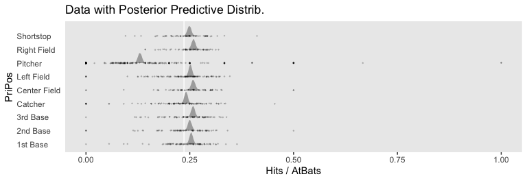<!-- -->

For kicks and giggles, we depicted the grand mean probability as the
white vertical line in the background with the `geom_vline()` line.

However, we can make our plot more directly analogous to Kruschke’s if
we’re willing to stretch a little. Recall that Kruschke used the beta
distribution with the \(\omega-\kappa\) parameterization in both his
statistical model and his plot code—both of which you can find detailed
in his `Jags-Ybinom-Xnom1fac-Mlogistic.R`. file. We didn’t use the beta
distribution in our `brm()` model and the parameters from that model
didn’t have as direct correspondences to the beta distribution the way
those from Kruschke’s JAGS model did. However, recall that we can
re-parameterize the beta distribution in terms of its mean \(\mu\) and
sample size \(n\), folowing the form

When we take the inverse logit of our intercepts, we do get vales in a
probability metric. We might consider inserting those probabilities into
the \(\mu\) parameter. Furthermore, we can take our `AtBats` sample
sizes and insert them directly into \(n\). As before, we’ll use the
average sample size per position.

``` r
# wrangle like a boss
nd %>% 
  add_fitted_draws(fit8, 
                   n = 20,
                   re_formula = Hits | trials(AtBats) ~ 1 + (1 | PriPos),
                   dpar = c("mu")) %>% 
  # use the equations from above
  mutate(alpha   = mu * AtBats, 
         beta    = (1 - mu) * AtBats) %>% 
  mutate(ll      = qbeta(.025, shape1 = alpha, shape2 = beta),
         ul      = qbeta(.975, shape1 = alpha, shape2 = beta)) %>% 
  mutate(theta   = map2(ll, ul, seq, length.out = 100)) %>% 
  unnest(theta) %>% 
  mutate(density = dbeta(theta, alpha, beta)) %>% 
  group_by(.draw) %>% 
  mutate(density = density / max(density)) %>% 
  
  # plot!
  ggplot(aes(y = PriPos)) +
  geom_ridgeline(aes(x = theta, height = -density, group = interaction(PriPos, .draw)),
                 fill = NA, color = adjustcolor("grey50", alpha.f = 1/3),
                 size = 1/4, scale = 3/4,
                 min_height = NA) +
  geom_jitter(data = my_data,
              aes(x = Hits / AtBats, size = AtBats),
              height = .05, alpha = 1/6, shape = 1) +
  scale_size_continuous(range = c(1/4, 4)) +
  labs(title = "Data with Posterior Predictive Distrib.",
       x     = "Hits / AtBats",
       y     = NULL) +
  coord_flip(ylim = c(0.67, 8.67)) +
  theme(panel.grid   = element_blank(),
        axis.ticks.x = element_blank(),
        axis.text.x  = element_text(angle = 90, hjust = 1),
        legend.position   = c(.956, .8),
        legend.background = element_rect(fill = "transparent", color = "white"),
        legend.key        = element_rect(fill = "transparent", color = "transparent"))
```

<!-- -->

Since we didn’t actually presume the beta distribution anywhere in our
`brm()` statistical model, I wouldn’t attempt to present this workflow
in a scientific outlet. Go with the previous plot. This attempt seems
dishonest. But it is kinda fun to see how far we can push our results.

Happily, our contrasts will be less contentious. Here’s the initial
wrangling.

``` r
# define our subset of positions
positions <- c("1st Base", "Catcher", "Pitcher")

# redefine `nd`
nd <- 
  my_data %>% 
  filter(PriPos %in% positions) %>% 
  group_by(PriPos) %>% 
  summarise(AtBats = mean(AtBats) %>% round(0))

# push the model through `fitted()` and wrangle
f <-
  fitted(fit8,
         newdata = nd,
         re_formula = Hits  | trials(AtBats) ~ 1 + (1 | PriPos),
         scale = "linear",
         summary = F) %>% 
  as_tibble() %>% 
  set_names(positions)

# what did we do?
head(f)
```

    ## # A tibble: 6 x 3
    ##   `1st Base` Catcher Pitcher
    ##        <dbl>   <dbl>   <dbl>
    ## 1      -1.12   -1.12   -1.92
    ## 2      -1.09   -1.14   -1.91
    ## 3      -1.07   -1.13   -1.89
    ## 4      -1.07   -1.13   -1.90
    ## 5      -1.05   -1.17   -1.91
    ## 6      -1.10   -1.17   -1.89

Here are our versions of the middle two panels of Figure 21.13.

``` r
f %>% 
  # compute the differences and put the data in the long format
  transmute(`Pitcher vs. Catcher`  = Pitcher - Catcher,
            `Catcher vs. 1st Base` = Catcher - `1st Base`) %>% 
  pivot_longer(everything()) %>% 
  mutate(name = factor(name, levels = c("Pitcher vs. Catcher", "Catcher vs. 1st Base"))) %>% 
  
  ggplot(aes(x = value)) +
  geom_vline(xintercept = 0, color = "white") +
  geom_histogram(color = "grey92", fill = "grey67",
                 size = .2, bins = 40) +
  stat_pointintervalh(aes(y = 0),
                      point_interval = mode_hdi, .width = c(.95, .5)) +
  scale_y_continuous(NULL, breaks = NULL) +
  xlab("Difference (in b)") +
  theme(panel.grid = element_blank()) +
  facet_wrap(~name, scales = "free", ncol = 2)
```

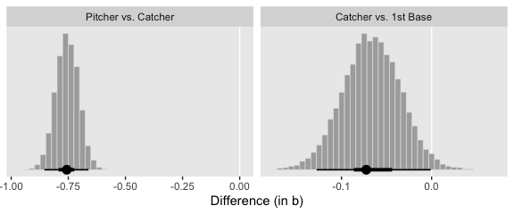<!-- -->

And here are our versions of the bottom two panels of Figure 21.13.

``` r
f %>% 
  # do the transformation before computing the differences
  mutate_all(inv_logit_scaled) %>% 
  transmute(`Pitcher vs. Catcher`  = Pitcher - Catcher,
            `Catcher vs. 1st Base` = Catcher - `1st Base`) %>% 
  pivot_longer(everything()) %>% 
  mutate(name = factor(name, levels = c("Pitcher vs. Catcher", "Catcher vs. 1st Base"))) %>% 
  
  ggplot(aes(x = value)) +
  geom_vline(xintercept = 0, color = "white") +
  geom_histogram(color = "grey92", fill = "grey67",
                 size = .2, bins = 40) +
  stat_pointintervalh(aes(y = 0),
                      point_interval = mode_hdi, .width = c(.95, .5)) +
  scale_y_continuous(NULL, breaks = NULL) +
  xlab("Difference (in probability)") +
  theme(panel.grid = element_blank()) +
  facet_wrap(~name, scales = "free", ncol = 2)
```

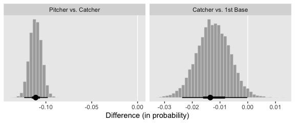<!-- -->

Note how our distributions are described as differences in probability,
rather than in \(\omega\).

## Reference

[Kruschke, J. K. (2015). *Doing Bayesian data analysis, Second Edition:
A tutorial with R, JAGS, and Stan.* Burlington, MA: Academic
Press/Elsevier.](https://sites.google.com/site/doingbayesiandataanalysis/)

## Session info

``` r
sessionInfo()
```

    ## R version 3.6.0 (2019-04-26)
    ## Platform: x86_64-apple-darwin15.6.0 (64-bit)
    ## Running under: macOS High Sierra 10.13.6
    ## 
    ## Matrix products: default
    ## BLAS:   /Library/Frameworks/R.framework/Versions/3.6/Resources/lib/libRblas.0.dylib
    ## LAPACK: /Library/Frameworks/R.framework/Versions/3.6/Resources/lib/libRlapack.dylib
    ## 
    ## locale:
    ## [1] en_US.UTF-8/en_US.UTF-8/en_US.UTF-8/C/en_US.UTF-8/en_US.UTF-8
    ## 
    ## attached base packages:
    ## [1] stats     graphics  grDevices utils     datasets  methods   base     
    ## 
    ## other attached packages:
    ##  [1] ggridges_0.5.1  tidybayes_1.1.0 brms_2.10.3     Rcpp_1.0.2      ggExtra_0.9     forcats_0.4.0  
    ##  [7] stringr_1.4.0   dplyr_0.8.3     purrr_0.3.3     readr_1.3.1     tidyr_1.0.0     tibble_2.1.3   
    ## [13] ggplot2_3.2.1   tidyverse_1.2.1
    ## 
    ## loaded via a namespace (and not attached):
    ##   [1] colorspace_1.4-1          ellipsis_0.3.0            rsconnect_0.8.15         
    ##   [4] ggstance_0.3.2            markdown_1.1              base64enc_0.1-3          
    ##   [7] rstudioapi_0.10           rstan_2.19.2              svUnit_0.7-12            
    ##  [10] DT_0.9                    fansi_0.4.0               lubridate_1.7.4          
    ##  [13] xml2_1.2.0                bridgesampling_0.7-2      codetools_0.2-16         
    ##  [16] knitr_1.23                shinythemes_1.1.2         zeallot_0.1.0            
    ##  [19] bayesplot_1.7.0           jsonlite_1.6              broom_0.5.2              
    ##  [22] shiny_1.3.2               compiler_3.6.0            httr_1.4.0               
    ##  [25] backports_1.1.5           assertthat_0.2.1          Matrix_1.2-17            
    ##  [28] lazyeval_0.2.2            cli_1.1.0                 later_1.0.0              
    ##  [31] htmltools_0.4.0           prettyunits_1.0.2         tools_3.6.0              
    ##  [34] igraph_1.2.4.1            coda_0.19-3               gtable_0.3.0             
    ##  [37] glue_1.3.1.9000           reshape2_1.4.3            cellranger_1.1.0         
    ##  [40] vctrs_0.2.0               nlme_3.1-139              crosstalk_1.0.0          
    ##  [43] xfun_0.10                 ps_1.3.0                  rvest_0.3.4              
    ##  [46] mime_0.7                  miniUI_0.1.1.1            lifecycle_0.1.0          
    ##  [49] gtools_3.8.1              MASS_7.3-51.4             zoo_1.8-6                
    ##  [52] scales_1.0.0              colourpicker_1.0          hms_0.4.2                
    ##  [55] promises_1.1.0            Brobdingnag_1.2-6         parallel_3.6.0           
    ##  [58] inline_0.3.15             shinystan_2.5.0           yaml_2.2.0               
    ##  [61] gridExtra_2.3             loo_2.1.0                 StanHeaders_2.19.0       
    ##  [64] stringi_1.4.3             dygraphs_1.1.1.6          pkgbuild_1.0.5           
    ##  [67] rlang_0.4.1               pkgconfig_2.0.3           matrixStats_0.55.0       
    ##  [70] HDInterval_0.2.0          evaluate_0.14             lattice_0.20-38          
    ##  [73] rstantools_2.0.0          htmlwidgets_1.5           labeling_0.3             
    ##  [76] tidyselect_0.2.5          processx_3.4.1            plyr_1.8.4               
    ##  [79] magrittr_1.5              R6_2.4.0                  generics_0.0.2           
    ##  [82] pillar_1.4.2              haven_2.1.0               withr_2.1.2              
    ##  [85] xts_0.11-2                abind_1.4-5               modelr_0.1.4             
    ##  [88] crayon_1.3.4              arrayhelpers_1.0-20160527 utf8_1.1.4               
    ##  [91] rmarkdown_1.13            grid_3.6.0                readxl_1.3.1             
    ##  [94] callr_3.3.2               threejs_0.3.1             digest_0.6.21            
    ##  [97] xtable_1.8-4              httpuv_1.5.2              stats4_3.6.0             
    ## [100] munsell_0.5.0             viridisLite_0.3.0         shinyjs_1.0
